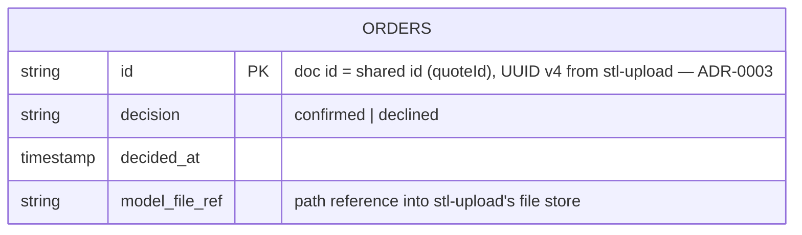

# Data model — order-confirmation

<!-- Stage 08. Adapted run of sdlc:generate-data-model: SAD §4/§9 ADR-0001 (Accepted) locks the
     persistence layer to Firestore, a NoSQL document store. The skill's default output
     (CREATE TABLE / .up.sql+.down.sql for golang-migrate) does not apply — there is no relational
     schema, no FK graph, no golang-migrate. This document instead specifies the Firestore
     collection layout, document shape, and write semantics, following the same rigor
     (bounded fields, explicit types, justified indexes, no business-value defaults) the skill
     applies to SQL. See _audit/data-model-2026-09-13.md for the full list of deviations. -->

## Store

**Firestore** (Google Cloud managed NoSQL, native mode) — SAD §3, §9 ADR-0001 (Accepted). No self-hosted database, no ORM/migration tool.

## Collection diagram



There is exactly one collection. `quote-engine` and `stl-upload` are external systems (SAD §3) — their data is read live via in-process calls (ADR-0002), never copied into this collection beyond the `model_file_ref` pointer. There is no FK graph to draw: Firestore has no referential-integrity feature, and the PRD explicitly scopes the order record to three fields (§6.1: "adds only a decision status, a timestamp, and a reference (path) to the model file — no new PII fields").

## Entities

### `orders` (collection)

One document per quote, keyed by the shared id (quoteId = stl-upload's file-id, threaded through unchanged per ADR-0003). One document = one final decision (AC-04); documents are never updated after creation (ADR-0004 accepted debt: no edit/re-decide path in v1).

| Field | Type | Constraints | Notes |
|---|---|---|---|
| *(doc id)* | string (UUID v4) | required, set by caller, immutable | Not a document field — the shared id from stl-upload (ADR-0003). Used as the Firestore document path segment: `orders/{id}`. |
| `decision` | string | required, one of `"confirmed"` \| `"declined"` (enforced in app code, not DB — no CHECK constraint per project convention) | AC-01 sets `"confirmed"`, AC-02 sets `"declined"`. |
| `decided_at` | Timestamp | required, set once at write time (server timestamp) | No `updated_at` — documents are immutable after creation (matches project's no-`updated_at` convention: history, if ever needed, is a separate concern, not an in-place edit). |
| `model_file_ref` | string | required | Path/reference to the model file in stl-upload's store, captured at decision time. Existence is checked live against stl-upload before write (AC-05); the ref itself is not re-validated after write — see SAD §11 "orphaned file reference" risk. |

**No `quote_id` field.** The document's own id already is the quoteId (ADR-0003); duplicating it into the body would be denormalization with no query that needs it (see Access patterns below).

**No persisted quote snapshot** (price, print time, cost breakdown). PRD §6.1 authoritatively scopes the order record's contents to the three fields above; the confirmation screen reads the live quote from quote-engine (SAD §6 flows 1–3) rather than this collection. If a future revision needs to show "what you were quoted" after quote-engine's own data ages out, that is a new field — flagged as a TBD below, not assumed here.

**Access patterns:**
- `create(orders/{id}, {decision, decided_at, model_file_ref})` — confirm/decline write (AC-01, AC-02). Firestore's atomic `create()` rejects a pre-existing doc id with `ALREADY_EXISTS`, which is the exactly-once mechanism for AC-04 (ADR-0004) — no unique-constraint migration needed, no composite index needed.
- `get(orders/{id})` — reopen-after-decision read (SAD §6 flow 6, US-04). Direct document-id lookup; Firestore requires no manual index for this.

**Constraints:** none expressible or needed at the store level beyond the id-based `create()` exactly-once guarantee above. `decision`'s enum constraint and any future validation live in application code (project convention: DB stays dumb).

## Indexes

None required. Both access patterns above are direct document-id operations (`create`/`get` by known id) — Firestore's automatic single-field indexing already covers them, and no flow in SAD §6 performs a query across the collection (e.g., "list all orders", "orders by decision") that would justify a composite index. Per the "one index per query, justified" principle: there is no query to justify one.

## Seeds

None. No bootstrap/admin data and no lookup tables are implied by the PRD or SAD for this feature.

## Test fixtures

Since this is a Node/TS project (no Go domain structs exist yet — CLAUDE.md confirms no code exists in-repo), the equivalent of the skill's Go factory convention is a TS helper:

```ts
// src/testfixtures/order.ts
export function newOrderFixture(overrides?: Partial<OrderDoc>): OrderDoc {
  return {
    decision: "confirmed",
    decided_at: new Date(),
    model_file_ref: "test-fixtures/model-example.test.stl",
    ...overrides,
  };
}
```

Not generated as a file yet — there is no `src/` tree to place it in (CLAUDE.md: "no application code" exists in this repo). Documented here so the first implementation PR has the shape to follow.

## TBDs

- **`model_file_ref`'s exact format** (stl-upload storage path vs. an opaque id vs. a signed URL) — depends on stl-upload's own storage design, which per PRD §8 is an open question ("stl-upload's model-file retention guarantee... or should order-confirmation snapshot/copy the file reference"). SAD §11 already resolved the snapshot-vs-live-check axis (live check, AC-05) but not the wire format of the reference itself.
- **Whether a quote snapshot ever needs to be persisted** — see "No persisted quote snapshot" note above. Deferred until a concrete need surfaces (e.g., a future "view your past order's quoted price" requirement); no such AC exists today.
- **quote-engine's final output contract** (PRD §8 open question) — does not change this document's shape (order-confirmation persists only `decision`/`decided_at`/`model_file_ref`, never quote-engine's fields directly), but is the blocking dependency for the confirm/decline route's request/response contract at `define-api` time.
