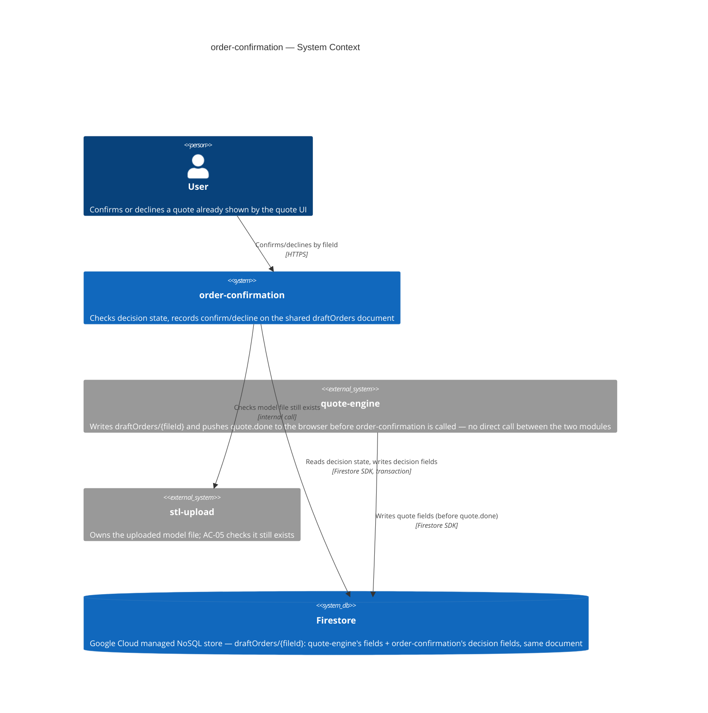
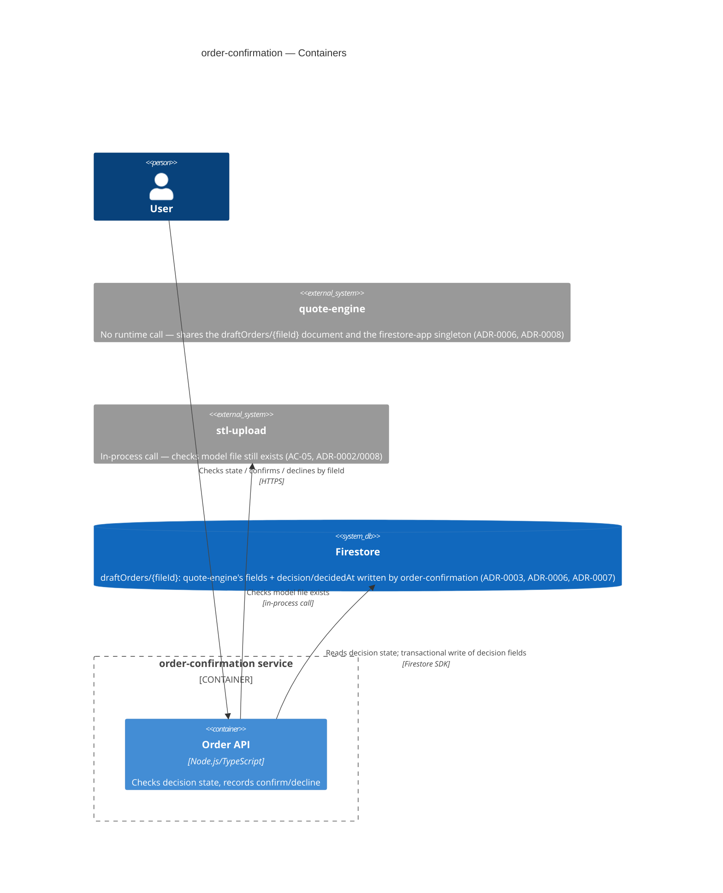
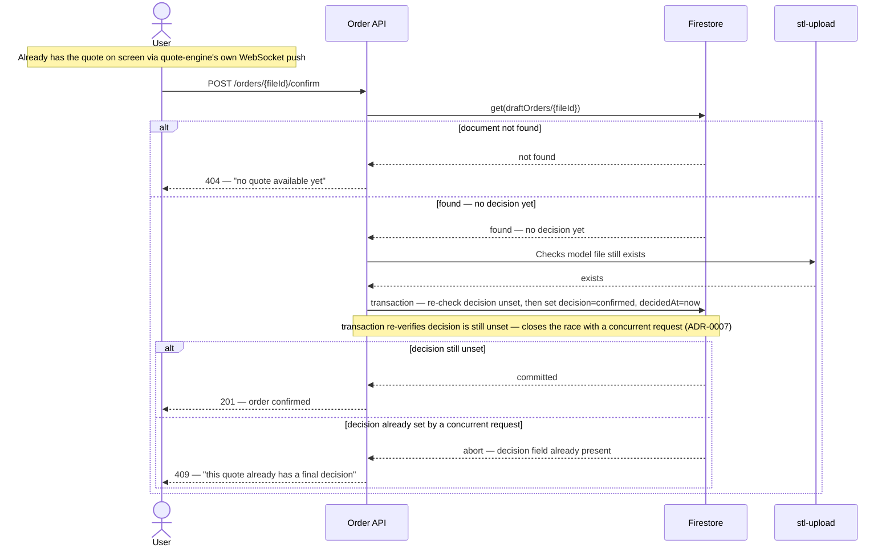
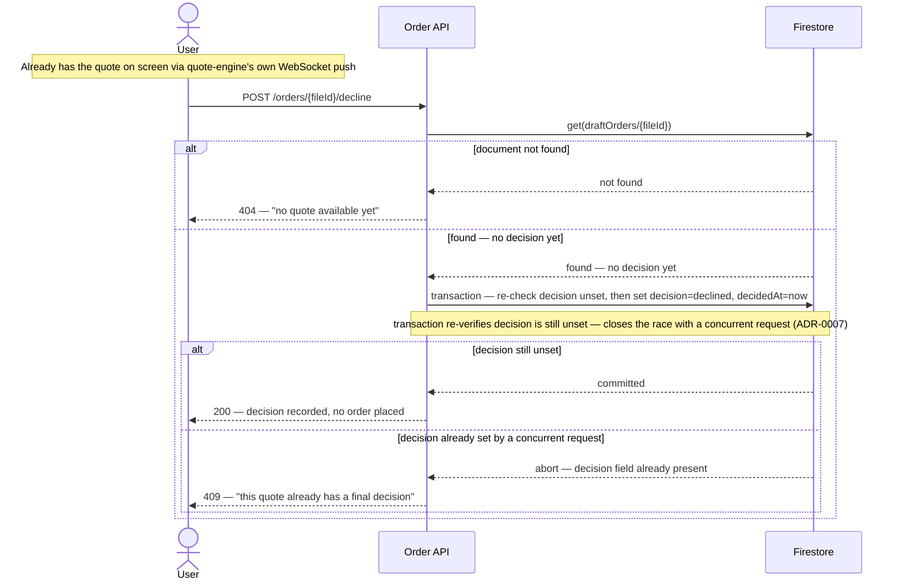
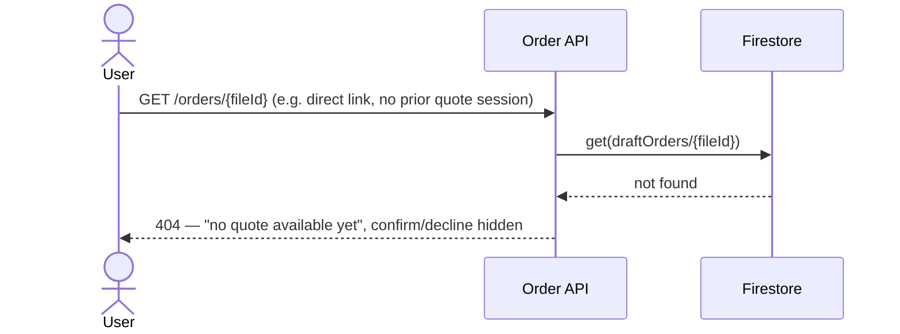
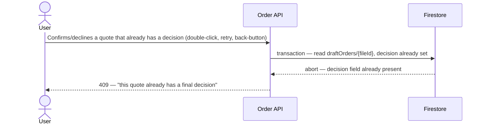
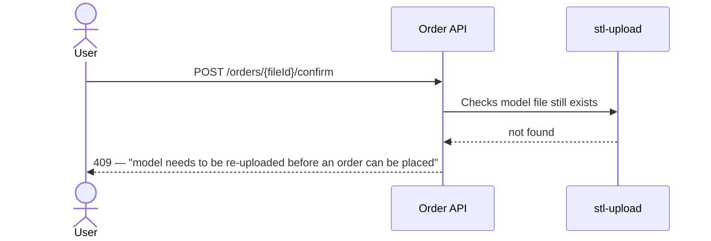
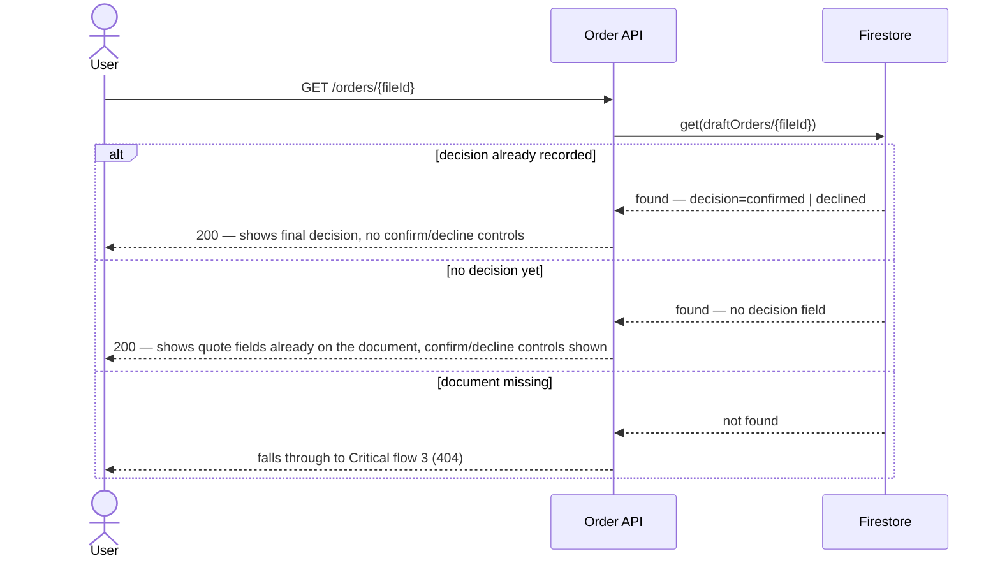

# Software Architecture Document — order-confirmation

<!-- Stages 04-05 → see sdlc/plugin/skills/architecture-design/SKILL.md -->
<!-- 12 Arc42 sections. Empty sections — <!-- N/A: <one-line reason> -->. -->
<!-- C4 Context (L1) lives inline in §3. C4 Container (L2) lives inline in §5. -->

> **2026-10-03 revision note.** This SAD was drafted ahead of quote-engine (PRD §1 "betting on quote-engine's eventual output shape"). quote-engine has since shipped with a materially different contract than assumed: a one-shot WebSocket to the browser (not an in-process call order-confirmation can read) and a Firestore `draftOrders/{fileId}` document written before the quote reaches the client. §3, §4, §5, §6, §7, §9, §11 are revised below to match the real contract (`docs/features/quote-engine/kb-quote-contract.md`); superseded/narrowed ADRs (0001, 0002, 0004, 0005) carry inline notes pointing at their replacements (0006, 0007, 0008). §1, §2, §10, §12 are materially unaffected and left as-is except where noted.

## 1. Introduction and goals

**Intent.** order-confirmation закриває третій, фінальний крок MVP-флоу маркетплейсу (upload → quote → confirm/decline). Після того як quote-engine рахує квоту (ціна, час друку, матеріал, cost breakdown), користувач бачить розбивку ціни й явно підтверджує або відхиляє квоту; рішення зберігається як єдине джерело правди про те, що сталося далі — акаунтів/авторизації в MVP ще немає (PRD §1, §3).

**Top-3 quality goals (1-liners; full scenarios in §10):**

1. Коректність доменного інваріанту — кожна квота отримує рівно одне записане рішення; повторний confirm/decline на ту саму квоту блокується, а не дублюється (AC-04, PRD §6 concurrency safety).
2. Продуктивність запису/читання — p95 запису confirm/decline ≤300 мс; p95 показу підсумку квоти ≤200 мс (PRD §6, дослівно).
3. Доступність — 99.5% щомісячний SLO (PRD §6, дослівно).

**Stakeholders.**

| Role | Interest | Sign-off owner? |
|---|---|---|
| User | Переглядає розбивку ціни, підтверджує/відхиляє квоту (US-01…US-05) | No |
| Tech Lead | Затверджує SAD перед stage 06 | Yes |
| Security Lead | Підтверджує обсяг security review — перший персистентний order-record і перший no-authz surface у флоу (PRD §6.1) | Yes |

## 2. Constraints

**Technical.**
- Node.js + TypeScript — єдине зафіксоване рішення по стеку (`docs/overview.md`, `CLAUDE.md`).
- Жодного framework/datastore/hosting рішення ще не прийнято — відкриті стратегічні вибори, вирішуються у §4/§5, не є попередніми обмеженнями.

**Organisational.**
- Effort budget: орієнтовно ~2 тижні за аналогією з comparably-scoped stl-upload (idea-brief §12), але старт фічі гейтиться не календарною датою, а стабілізацією контракту quote-engine (PRD §1) — це м'якіший дедлайн, ніж у stl-upload.
- Team: solo maintainer, без чергування (той самий власник фічі, що й stl-upload).

**Conventions.**
- `CLAUDE.md` наразі не має код-конвенцій (репозиторій до-коду) — немає готового naming/error-handling патерну для успадкування; stl-upload вже зафіксував перші конвенції (шаровий стиль ADR-0004, UUID v4 ADR-0005) — order-confirmation оцінює їх окремо у §5/§8, не успадковує автоматично.

**Regulatory / external.**
- Дані класифіковані як internal; жодного нового PII не додається понад те, що вже збирають stl-upload/quote-engine (PRD §6.1).
- Security review обов'язковий — перший персистентний order-record у маркетплейсі і перший no-authorization-check поверхневий ризик (PRD §6.1).

## 3. Context and scope

<!-- brownfield: N/A — order-confirmation itself is still greenfield (no code under src/modules/order-confirmation yet); quote-engine, its one real dependency, has shipped — see 2026-10-03 revision note above. -->

**Revised 2026-10-03.** quote-engine already delivers the quote to the browser directly over its own WebSocket (`quote.done`, quote-engine ADR-0001) and persists it to `draftOrders/{fileId}` in Firestore *before* sending that message (quote-engine ADR-0002) — by the time the user reaches the confirm/decline screen in the same session, the browser already has the price and cost breakdown to display, and order-confirmation needs nothing from the document beyond existence/decision-state to act on a confirm/decline (fileId is sufficient). The one exception is **US-04 reopening**: a user who leaves and comes back has no live WebSocket session and no client-held quote data, so the `GET` used for AC-03/AC-04/US-04 (§5, §6 flow 6) must also return the quote fields already stored on the document for display — this is a read of data already in Firestore, not a call to quote-engine, and doesn't reopen the "no quote-engine coupling" decision (ADR-0008). order-confirmation also checks with stl-upload that the model file still exists (AC-05), then writes the decision onto the document (ADR-0006, ADR-0007). There is **no runtime call from order-confirmation into quote-engine** — the two modules share a Firestore document and an id convention, nothing else (ADR-0008).

**External systems (in / out):**

| Actor or system | Type | Interaction |
|---|---|---|
| User | Person | Confirms/declines a quote already shown to them by the quote UI |
| quote-engine | System (internal) | Writes `draftOrders/{fileId}` before this feature is ever called — no direct call between the two modules |
| stl-upload | System (internal) | Власник файлу моделі; AC-05 перевіряє, що файл ще існує — in-process call (ADR-0002/0008) |
| Firestore | System_Ext (managed cloud datastore) | Shared document store: quote-engine writes the quote fields, order-confirmation writes the decision fields on the same `draftOrders/{fileId}` document (ADR-0006) |

**C4 Context (L1):**



## 4. Solution strategy

**Top strategic choices (the seeds for ADRs):**

1. **Firestore як сховище order-записів** — керований NoSQL-стор Google Cloud; немає потреби піднімати/адмініструвати БД-сервер у межах solo-maintainer бюджету (§2), atomic per-document write вкладається в p95 ≤300мс (PRD §6). → ADR-0001 (**superseded by ADR-0006** — Firestore-as-storage still stands; the "separate order-record document" framing doesn't).
2. ~~In-process виклики функцій між order-confirmation, quote-engine, stl-upload~~ — **revised 2026-10-03**: quote-engine shipped with no in-process read API (one-shot WebSocket to the browser, no exported read function). In-process calls stay **only** for stl-upload's file-existence check (AC-05); the original latency rationale (§1 QG-2, same-process precedent) still applies there. → ADR-0002 (narrowed by **ADR-0008**).
3. **Наскрізний UUID v4 (file-id → quoteId → order id)** — той самий ідентифікатор, який stl-upload генерує при валідації файлу (ADR-0005 у stl-upload), проходить без змін через слайсинг і фіксується як ID order-документа. Узгоджено з PRD §3 non-goals (немає re-quote — модель:квота:order = 1:1:1). **Confirmed 2026-10-03**: quote-engine's `draftOrders` collection is in fact keyed by `fileId` exactly as assumed (`docs/features/quote-engine/kb-quote-contract.md`) — this closes the §11 risk that flagged this as an unconfirmed bet. → ADR-0003 (unchanged, now confirmed against the real contract).
4. ~~Firestore `create()` як механізм exactly-once для AC-04~~ — **revised 2026-10-03**: the write target is now `draftOrders/{fileId}` (decision #5 below), a document quote-engine already creates — `create()` would always fail with `ALREADY_EXISTS`. Replaced with a Firestore transaction that checks the `decision` field is unset before writing. → ADR-0004 (**superseded by ADR-0007**).
5. **Record the decision on quote-engine's existing `draftOrders/{fileId}` document, not a separate collection** — the browser already has the quote (via quote-engine's own WebSocket push) by the time order-confirmation is called; it only needs to flip that document from "quoted" to "decided." Avoids a second collection, avoids duplicating quote data, and needs no new quote-engine API. → **ADR-0006** (new, 2026-10-03).
6. ~~Server-Sent Events для сигналу готовності квоти~~ — **dropped 2026-10-03**: quote-engine's own WebSocket already pushes `quote.done` straight to the browser before order-confirmation is ever involved (feature-owner direction, 2026-10-03 Socratic revision). The problem this solved no longer exists. → ADR-0005 (**superseded by ADR-0006**, no replacement needed).

**Успадковано з PRD (не перевирішується тут):** авторизація — v1 свідомо без owner-перевірки на confirm/decline (feature owner override, PRD §1 «Decision overrides», PRD §8 open question) — це вже зафіксований, а не новий вибір.

Each tactical decision in later sections should be traceable to one of these strategic seeds. Tactical decisions that *contradict* a strategic choice are red flags — surface them in §11 Risks.

## 5. Building block view

Простий шаровий стиль (routes/services/repositories) — новий модуль у тому ж Node/TS-монолiтi, за прикладом stl-upload ADR-0004: менше файлів/інтерфейсів на старті, узгоджено з 2-тижневим орієнтовним бюджетом solo-maintainer (§2). Не ADR-гідне рішення — внутрішнє планування одного модуля, не міжмодульний контракт.

**Revised 2026-10-03.** No GET-quote-summary route and no SSE stream — the quote is already on the client (quote-engine's WebSocket push) before this module is ever called (ADR-0006). The module's own HTTP surface is limited to the decision check/write. A new shared Firestore-app module is introduced so order-confirmation and quote-engine don't both call `firebase-admin`'s `initializeApp()` (which throws on a second default-app init) — this is an implementation convention, not ADR-gated (one criterion only: multi-module, no real alternative given both must use the same credential).

**Internal decomposition:**

```
src/shared/
└── firestore-app.ts   <single firebase-admin initializeApp() call, shared by quote-engine and
                         order-confirmation repositories — extracted from quote-engine's existing
                         quote-repository.ts (2026-10-03, see §11 risk: touches shipped code)>

src/modules/order-confirmation/
├── routes/        <HTTP: GET /api/v1/orders/:fileId (existence + decision state for AC-03/AC-04;
│                    also returns the quote fields already on the document, needed only for the
│                    US-04 reopen case where no client-held quote data exists), POST .../confirm,
│                    POST .../decline (act on fileId alone, no quote-field read needed)>
├── services/       <confirm/decline use case: перевіряє файл через stl-upload (ADR-0002/0008 —
│                    in-process виклик), пише рішення транзакційно через repository (ADR-0007)>
├── repositories/   <Firestore repository over quote-engine's draftOrders collection — read for
│                    existence/decision-state, transactional write of decision fields (ADR-0006, 0007)>
└── module.ts       <self-wiring>
```

**C4 Container (L2):**



## 6. Runtime view

**Revised 2026-10-03.** All six flows rewritten: quote-engine pushes the quote to the browser directly over its own WebSocket and writes `draftOrders/{fileId}` before order-confirmation is ever called (ADR-0006); there is no quote-engine call or SSE stream from this module (ADR-0005 dropped, ADR-0008). The former `create()`-based exactly-once check (flow 4) is now a Firestore transaction (ADR-0007) that aborts if `decision` is already set.

**Re-examined 2026-10-03 (`sdlc:complete-sequence-diagrams`).** Coverage check against PRD §4: all 5 user stories already have a diagram (US-01→flow 3, US-02→flows 1/5, US-03→flow 2, US-04→flow 6, US-05→flow 4) — no missing UCs, no async/webhook/cron signal in the PRD to draw. Flows 1 and 2 were tightened for internal consistency: both now show a not-found branch (a client could POST confirm/decline without first GETting the screen) and make the transaction's decision-unset re-check explicit and symmetric — the prior text gave confirm an "abort if already set" note that decline lacked, though AC-04 binds both equally. All 6 blocks validated against the Mermaid parser (`mermaid@11`, parse-only — `mmdc` itself needs a headless Chrome binary this sandbox has no network path to install). No new actors; no new ADR potential beyond what 0006-0008 already cover.

**Critical flow 1: Happy path — confirm (US-02, AC-01)**



<!-- 2026-10-03 re-examination (sdlc:complete-sequence-diagrams): added the not-found branch (a direct POST without a prior GET is possible) and made the transaction's re-check explicit and symmetric with flow 2 — the original text gave confirm an "(abort if decision already set)" note that decline (flow 2) lacked, even though AC-04 applies to both equally. -->

**Critical flow 2: Happy path — decline (US-03, AC-02)**



<!-- 2026-10-03 re-examination (sdlc:complete-sequence-diagrams): mirrors flow 1's not-found branch + explicit transaction re-check for symmetry — AC-04's invariant applies to decline exactly as it does to confirm. -->

**Critical flow 3: No quote yet (US-01, AC-03)**



**Critical flow 4: Domain invariant — duplicate confirm/decline blocked (AC-04)**



**Critical flow 5: Model file gone (AC-05)**



**Critical flow 6: Reopening after a decision (US-04)**



## 7. Deployment view

order-confirmation деплоїться в тому ж single Node/TS-процесі, що й stl-upload/quote-engine — прямий наслідок ADR-0002/0008 (in-process виклик до stl-upload вимагає co-location), не окреме ADR-гідне рішення. Один процес на одній VM через systemd/pm2, без контейнерної оркестрації — той самий прецедент, що й stl-upload §7 (§2 solo-maintainer бюджет).

**Revised 2026-10-03.** No SSE connections to track or scale — ADR-0005 is dropped (§4, §6). The shared `firestore-app.ts` singleton (§5) means both quote-engine and order-confirmation read the same `FIRESTORE_CREDENTIALS_JSON`; a boot failure there now affects both features, not just quote-engine — unchanged risk surface (already fails the boot per quote-engine's existing ADR-0002), but now shared.

**Monitoring:**
- Latency confirm/decline запису — p95 ≤300мс (PRD §6, дослівно).
- Latency показу стану рішення (GET) — p95 ≤200мс (PRD §6, дослівно) — тепер це простий Firestore `get()`, без очікування на quote-engine.
- Alert: сплеск 409 на confirm/decline (AC-04 duplicate-attempts) — сигнал double-submit-бага чи зловживання (PRD §6.1 spam-create abuse case).

**Scaling thresholds:**
- Один інстанс у v1 — узгоджено з ADR-0002/0008 (in-process виклик до stl-upload вимагає co-location).
- Горизонтальне масштабування вимагає розділити stl-upload на окремий деплой-юніт (переглянути ADR-0002/0008) — задокументовано як accepted debt у §11. Firestore-залежна частина (ADR-0006/0007) вже stateless і масштабується без змін.

## 8. Crosscutting concepts

<!-- Greenfield: CLAUDE.md ще не має власних logging/auth/error-конвенцій — це свіжі рішення, не override. -->

| Concept | Convention | Where defined |
|---|---|---|
| Logging | Структуровані JSON-логи, поле `request_id`; жодного вмісту рішення понад id/статус | here |
| Authentication | N/A — MVP не має акаунтів, свідомий feature-owner override | PRD §1, §8 |
| Error handling | 404 — немає квоти (AC-03); 409 — повторне рішення (AC-04) або файл відсутній (AC-05); повідомлення без технічного жаргону | here |
| ID strategy | Наскрізний UUID v4, успадкований від stl-upload file-id — новий ID не генерується; confirmed against quote-engine's real `draftOrders` keying (2026-10-03) | ADR-0003 |
| Internationalisation | N/A, лише англійська | — |
| Observability | Latency-метрики (GET + confirm/decline); SSE connection count row removed 2026-10-03 (ADR-0005 dropped) | §7 |
| Rate limiting | 10 confirm/decline спроб/хв на сесію | PRD §6.1 |
| Firestore client | Shared `firestore-app.ts` singleton (`src/shared/`) — one `initializeApp()` call reused by quote-engine and order-confirmation; avoids firebase-admin's "default app already exists" error | §5, revised 2026-10-03 |
| Document ownership | `draftOrders/{fileId}` is co-owned: quote-engine writes the quote fields, order-confirmation writes `decision`/`decidedAt` — no schema contract enforced between the two writers | ADR-0006, §11 accepted debt |

## 9. Architecture decisions

<!-- 🎯 Навіщо: ЗВОРОТНИЙ ІНДЕКС на папку adr/. `ls adr/` дає файли, §9 дає семантику —    -->
<!--           чому вони існують, до якого зрізу SAD привʼязані, у якому статусі.           -->
<!-- 📋 Що писати: таблиця з 4 колонками. Один рядок на ADR. Mixed status — це OK.         -->
<!-- 📌 Приклад: «0001 | Зберігати урок як таблицю блоків | Accepted | §4».                -->

| # | Title | Status | Section |
|---|---|---|---|
| 0001 | Store order records in Firestore | Superseded by 0006 (collection framing only) | §4 |
| 0002 | Use in-process module calls for order-confirmation integration | Accepted — narrowed by 0008 | §4 |
| 0003 | Thread stl-upload's file-id as the shared quote/order id | Accepted (confirmed 2026-10-03 against real quote-engine contract) | §4 |
| 0004 | Use Firestore document create() for exactly-once decisions | Superseded by 0007 | §4 |
| 0005 | Use Server-Sent Events for slicing-completion updates | Superseded by 0006 (dropped) | §4 |
| 0006 | Record confirm/decline decisions directly on quote-engine's draftOrders document | Accepted | §3, §4, §5 |
| 0007 | Use a Firestore transaction with a decision-field precondition for exactly-once confirm/decline | Accepted | §4, §6 |
| 0008 | Scope in-process module calls to stl-upload only | Accepted | §3, §4, §5 |

ADR files live under `docs/features/order-confirmation/adr/NNNN-<title>.md`. 2026-10-03 revision: 0001/0004/0005 superseded, 0002 narrowed, 0006-0008 added — see each file's inline note for why.

## 10. Quality requirements

**QG-1. Коректність доменного інваріанту (AC-04)**
- **When:** два запити confirm/decline надходять на ту саму квоту (подвійний клік, retry, back-button).
- **Then:** записується рівно одне рішення; другий запит відхиляється — «duplicate confirm/decline on the same quote is rejected, not double-recorded» (PRD §6, дослівно).
- **How verify:** інтеграційний тест — два конкурентних `POST /confirm` на той самий fileId; перевірка: `decision`-поле на `draftOrders/{fileId}` виставлене рівно один раз (ADR-0007 transaction), рівно одна відповідь 409 (revised 2026-10-03 — раніше перевірялось через `create()`, ADR-0004, now superseded).

**QG-2. Продуктивність запису/читання**
- **When:** користувач підтверджує/відхиляє квоту під нормальним навантаженням.
- **Then:** p95 запису confirm/decline ≤300 мс; p95 показу підсумку квоти ≤200 мс (PRD §6, дослівно).
- **How verify:** k6 load test при ≥20 req/s на інстанс (PRD §6, дослівно), вимірюються обидва p95.

**QG-3. Доступність**
- **When:** штатна робота фічі протягом місяця.
- **Then:** 99.5% щомісячний SLO (PRD §6, дослівно).
- **How verify:** uptime/SLO dashboard, що трекає відношення успішних confirm/decline до 5xx помилок за місяць.

## 11. Risks and technical debt

<!-- N/A: greenfield — no brownfield gotchas from Explore report -->

| Risk / debt | Severity | Mitigation | Owner |
|---|---|---|---|
| Co-owned Firestore document — quote-engine writes the quote fields, order-confirmation writes `decision`/`decidedAt` on the same `draftOrders/{fileId}` doc (ADR-0006), with no schema contract enforced between the two writers | Medium | Accepted for v1 given both modules are in one monolith with a shared type; revisit if either module is split into a separate deploy unit or the schema needs independent evolution | Yakiv Vakoliuk |
| Extracting `firestore-app.ts` (§5, §7) touches quote-engine's existing, shipped `quote-repository.ts` to remove its inline `initializeApp()` call | Medium | Requires a regression check on quote-engine's existing Firestore write path (unit + integration tests already in place per quote-engine T13) before/alongside order-confirmation's implementation | Yakiv Vakoliuk |
| **Re-quote erases a recorded decision** — `quote-repository.ts`'s `writeDraftOrder` uses `draftOrders.doc(fileId).set(order)` with no `merge: true` and no check for an existing `decision` field. A re-quote of the same `fileId` *after* a confirm/decline silently replaces the whole document, wiping `decision`/`decidedAt` and re-enabling a second confirm — ADR-0007's transaction only guards against two order-confirmation writers, not against quote-engine's independent write. Directly undermines AC-04/QG-1 (found by Step-8 critic, 2026-10-03) | **High** | Needs a quote-engine-side fix (reject re-quote once `draftOrders/{fileId}.decision` is set, or `set(..., {merge:true})` + precondition) — out of this SAD's scope to decide unilaterally; raise with quote-engine's owner before either feature ships | Yakiv Vakoliuk |
| Stale-price confirm — немає staleness/expiry перевірки квоти у v1 (PRD §1 override, §6.1). The decision transaction (ADR-0007) reads whatever price is on the document at confirm time, not a client-supplied value — never trust a price submitted by the client | Medium | Свідомо прийнятий ризик; переглянути після запуску за сигналами скарг на ціну | Yakiv Vakoliuk |
| Open architectural decision: PRD §6's "quote-summary display ≤200ms" NFR (QG-2) no longer has a step inside order-confirmation to measure — the quote is now displayed by quote-engine's own WebSocket/UI flow before this module is called (ADR-0006). The GET endpoint's ≤200ms (§7) covers a different thing (decision-state read) | Open question | Resolve before stage 06 sign-off: either PM retargets PRD §6 QG-2 to quote-engine's SAD, or confirms the GET-decision-state reading already satisfies it as written | Yakiv Vakoliuk |
| Orphaned file reference — модель може бути видалена stl-upload retention policy вже ПІСЛЯ підтвердження order (AC-05 перевіряє лише в момент рішення, не «після») | Medium | Flagged для наступного перегляду — можливе рішення: retention guarantee в stl-upload | Yakiv Vakoliuk |
| Немає authorization-перевірки на confirm/decline у v1 (PRD §1 feature-owner override) | Medium | Свідомо прийнятий ризик, узгоджено з відсутністю акаунтів у MVP | Yakiv Vakoliuk |

**Resolved by the original SAD (2026-09-12):**
- PRD §8's "no-authz check acceptable for v1?" open question is **closed as-is**: feature-owner's PRD §1 override stands.
- PRD §8's "stl-upload retention guarantee vs. order-confirmation snapshot" open question: AC-05 and §6 flow 5 specify a **live check** against stl-upload at confirm time, not a snapshot.

**Resolved by this revision (2026-10-03):**
- The former "quote-engine not yet designed — quoteId = file-id assumption needs confirmation" risk is **closed**: quote-engine shipped and its `draftOrders` collection is in fact keyed by `fileId` exactly as ADR-0003 assumed (`docs/features/quote-engine/kb-quote-contract.md`).
- The former "open architectural decision: quote-engine's final output contract" row is **closed**: the contract is documented and stable (`docs/features/quote-engine/kb-quote-contract.md`); order-confirmation no longer needs to read it at all (ADR-0006), which makes most of the prior uncertainty moot.
- The SSE-scaling risk is **removed, not just mitigated**: ADR-0005 is dropped, so there is no SSE connection count to scale.

**Accepted debt (acceptable in v1, plan to fix later):**
- The Firestore transaction (ADR-0007) does not support future decision *revision* (contradicts current PRD §3 non-goals) — a future release needing edit/re-decide would extend the transaction with an explicit "supersede" path.
- Layered style (§5) may need refactor into clearer boundaries if the module grows beyond its current confirm/decline scope — same caveat as stl-upload ADR-0004.
- `draftOrders` is a misnomer once a document can carry a final decision (ADR-0006 Neutral) — left as-is to avoid touching quote-engine's shipped collection name; candidate for a future rename pass.

## 12. Glossary

| Term | Meaning |
|---|---|
| Order | Запис рішення користувача (confirm/decline) на квоту. NOT quote (квота — пропозиція, order — вже прийняте рішення) — CONTEXT.md. |
| Quote | Цінова пропозиція (час друку + матеріал + ціна), яку рахує quote-engine зі слайсингу валідної моделі. NOT order — CONTEXT.md. |
| Cost breakdown | Розкладка фінальної ціни квоти на компоненти. NOT quote (квота — вся пропозиція, breakdown — лише розклад ціни всередині неї) — CONTEXT.md. |
| User | Особа, яка завантажує модель для друку і приймає рішення confirm/decline. NOT vendor — CONTEXT.md. |
| Model | 3D-об'єкт, який користувач хоче надрукувати. NOT STL file — CONTEXT.md. |
| STL file | Формат файлу, що кодує поверхню моделі як набір трикутників; order-confirmation перевіряє лише його наявність (AC-05), не вміст. NOT model — CONTEXT.md. |
| Shared id / quoteId | Наскрізний UUID v4, згенерований stl-upload як file-id (ADR-0005 у stl-upload) і використаний без змін як Firestore document id для `draftOrders/{fileId}` (ADR-0003, confirmed against quote-engine's real contract; ADR-0006). Не в CONTEXT.md — флаг для `sdlc:fix-term`. |
| draftOrders | Firestore-колекція, яку створює quote-engine (ключ — `fileId`): зберігає квоту (price/breakdown/filename/timings), а order-confirmation дописує туди ж `decision`/`decidedAt` (ADR-0006) — спільний документ, не окремий `orders`. Не в CONTEXT.md — флаг для `sdlc:fix-term`. |
| Slicing | Процес, у якому quote-engine рахує квоту з валідної моделі; статус і результат доставляються напряму в браузер через власний WebSocket quote-engine (quote-engine ADR-0001), без SSE з боку order-confirmation (ADR-0005 — dropped 2026-10-03). Не в CONTEXT.md — флаг для `sdlc:fix-term`. |

<!-- "Shared id / quoteId" і "Slicing" surfaced during this pass — flag for sdlc:fix-term follow-up. -->
