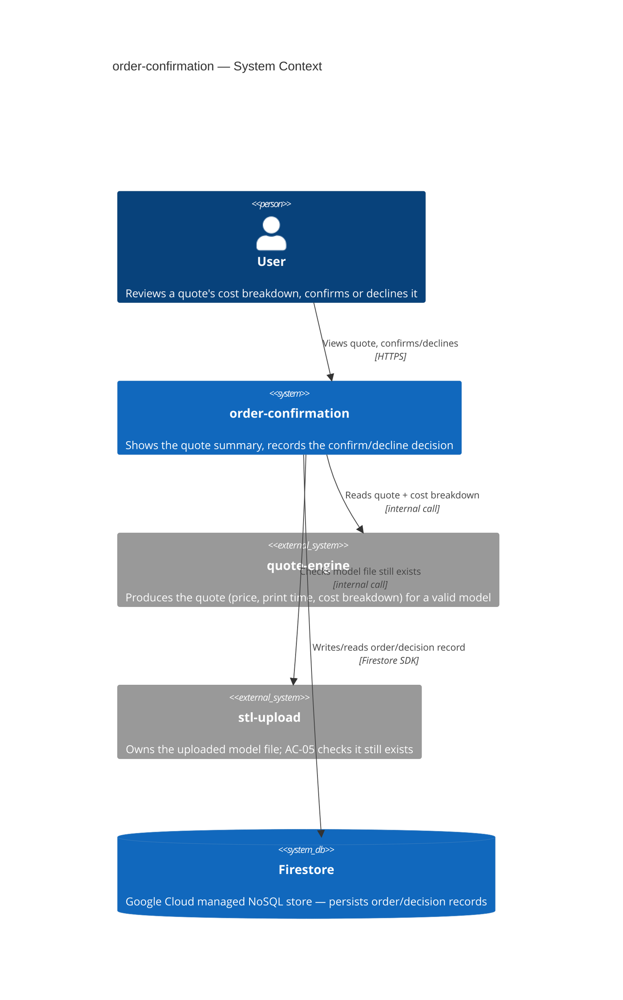
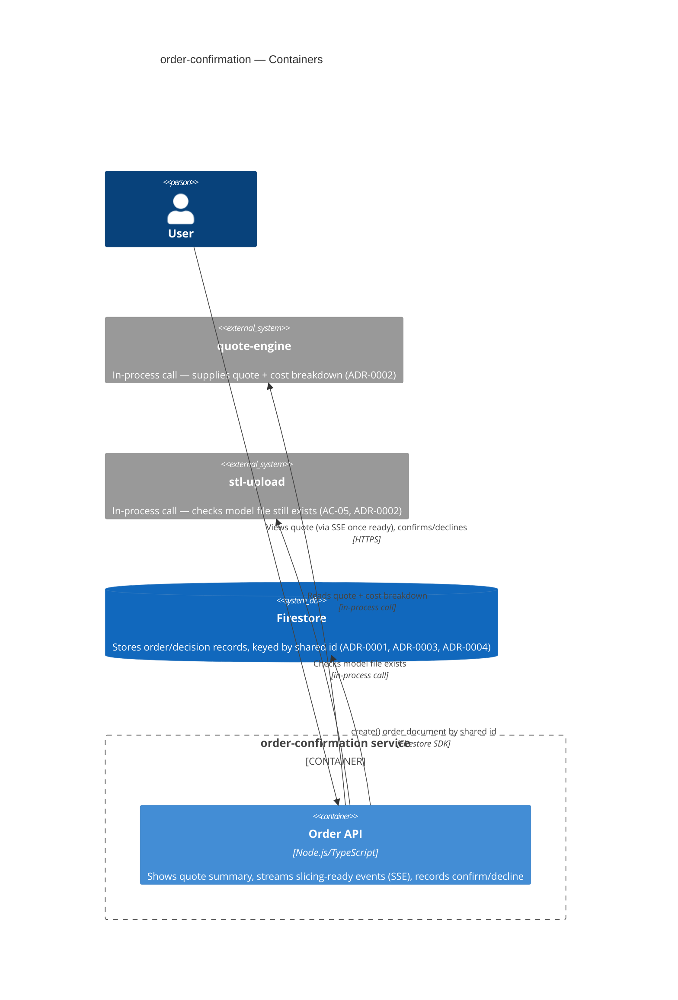
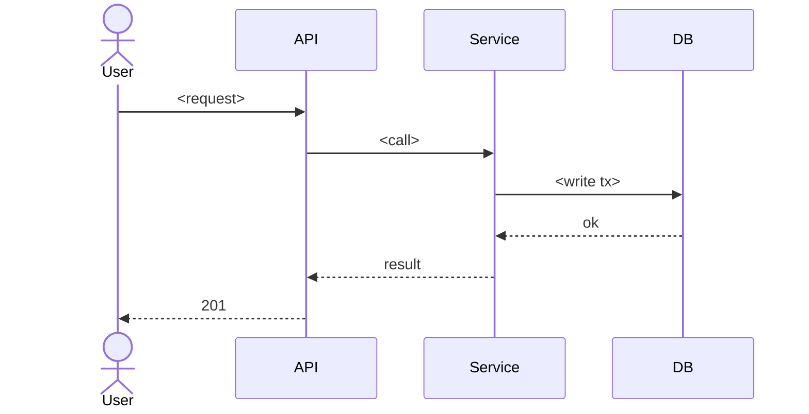

# Software Architecture Document — order-confirmation

<!-- Stages 04-05 → see sdlc/plugin/skills/architecture-design/SKILL.md -->
<!-- 12 Arc42 sections. Empty sections — <!-- N/A: <one-line reason> -->. -->
<!-- C4 Context (L1) lives inline in §3. C4 Container (L2) lives inline in §5. -->

## 1. Introduction and goals

**Intent.** order-confirmation закриває третій, фінальний крок MVP-флоу маркетплейсу (upload → quote → confirm/decline). Після того як quote-engine рахує квоту (ціна, час друку, матеріал, cost breakdown), користувач бачить розбивку ціни й явно підтверджує або відхиляє квоту; рішення зберігається як єдине джерело правди про те, що сталося далі — акаунтів/авторизації в MVP ще немає (PRD §1, §3).

**Top-3 quality goals (1-liners; full scenarios in §10):**

1. Коректність доменного інваріанту — кожна квота отримує рівно одне записане рішення; повторний confirm/decline на ту саму квоту блокується, а не дублюється (AC-04, PRD §6 concurrency safety).
2. Продуктивність запису/читання — p95 запису confirm/decline ≤300 мс; p95 показу підсумку квоти ≤200 мс (PRD §6, дослівно).
3. Доступність — 99.5% щомісячний SLO (PRD §6, дослівно).

**Stakeholders.**

| Role | Interest | Sign-off owner? |
|---|---|---|
| User | Переглядає розбивку ціни, підтверджує/відхиляє квоту (US-01…US-05) | No |
| Tech Lead | Затверджує SAD перед stage 06 | Yes |
| Security Lead | Підтверджує обсяг security review — перший персистентний order-record і перший no-authz surface у флоу (PRD §6.1) | Yes |

## 2. Constraints

**Technical.**
- Node.js + TypeScript — єдине зафіксоване рішення по стеку (`docs/overview.md`, `CLAUDE.md`).
- Жодного framework/datastore/hosting рішення ще не прийнято — відкриті стратегічні вибори, вирішуються у §4/§5, не є попередніми обмеженнями.

**Organisational.**
- Effort budget: орієнтовно ~2 тижні за аналогією з comparably-scoped stl-upload (idea-brief §12), але старт фічі гейтиться не календарною датою, а стабілізацією контракту quote-engine (PRD §1) — це м'якіший дедлайн, ніж у stl-upload.
- Team: solo maintainer, без чергування (той самий власник фічі, що й stl-upload).

**Conventions.**
- `CLAUDE.md` наразі не має код-конвенцій (репозиторій до-коду) — немає готового naming/error-handling патерну для успадкування; stl-upload вже зафіксував перші конвенції (шаровий стиль ADR-0004, UUID v4 ADR-0005) — order-confirmation оцінює їх окремо у §5/§8, не успадковує автоматично.

**Regulatory / external.**
- Дані класифіковані як internal; жодного нового PII не додається понад те, що вже збирають stl-upload/quote-engine (PRD §6.1).
- Security review обов'язковий — перший персистентний order-record у маркетплейсі і перший no-authorization-check поверхневий ризик (PRD §6.1).

## 3. Context and scope

<!-- brownfield: N/A — greenfield repo -->

Після того як quote-engine рахує квоту, користувач переглядає order-confirmation екран з cost breakdown і підтверджує або відхиляє квоту. Рішення (order record) персистентно зберігається у Firestore — керованому NoSQL-сховищі Google Cloud, яке є зовнішньою системою відносно нашого коду (інший власник процесу, інший lifecycle). AC-05 додатково перевіряє, що файл моделі в stl-upload ще існує перед підтвердженням.

**External systems (in / out):**

| Actor or system | Type | Interaction |
|---|---|---|
| User | Person | Переглядає cost breakdown, підтверджує/відхиляє квоту |
| quote-engine | System (internal) | Постачає квоту + cost breakdown, які показує/по яким вирішує ця фіча |
| stl-upload | System (internal) | Власник файлу моделі; AC-05 перевіряє, що файл ще існує |
| Firestore | System_Ext (managed cloud datastore) | Персистентне сховище order/decision-записів — шар персистенції фічі |

**C4 Context (L1):**



## 4. Solution strategy

**Top strategic choices (the seeds for ADRs):**

1. **Firestore як сховище order-записів** — керований NoSQL-стор Google Cloud; немає потреби піднімати/адмініструвати БД-сервер у межах solo-maintainer бюджету (§2), atomic per-document write вкладається в p95 ≤300мс (PRD §6). → ADR-0001.
2. **In-process виклики функцій між order-confirmation, quote-engine, stl-upload** — усі три лишаються модулями одного Node/TS-монолiту (§2, немає окремих деплой-юнітів); повторює вже встановлений прецедент stl-upload↔quote-engine (пряме читання з диска, без HTTP). Уникає зайвої мережевої затримки під бюджет §1 QG-2 (p95 ≤200мс на показ квоти). → ADR-0002.
3. **Наскрізний UUID v4 (file-id → quoteId → order id)** — той самий ідентифікатор, який stl-upload генерує при валідації файлу (ADR-0005 у stl-upload), проходить без змін через слайсинг і фіксується як ID order-документа. Узгоджено з PRD §3 non-goals (немає re-quote — модель:квота:order = 1:1:1). → ADR-0003.
4. **Firestore `create()` як механізм exactly-once для AC-04** — document id = наскрізний id з (3); Firestore атомарно відхиляє повторний `create()` тим самим id (ALREADY_EXISTS), що замінює SQL UNIQUE constraint без додаткового коду блокувань. → ADR-0004.
5. **Server-Sent Events для сигналу готовності квоти** — після stl-upload користувач бачить loading-стан під час слайсингу; SSE штовхає подію «квота готова» з мінімальною затримкою, без full-page reload і без зайвої складності WebSocket для односпрямованого сигналу. → ADR-0005.

**Успадковано з PRD (не перевирішується тут):** авторизація — v1 свідомо без owner-перевірки на confirm/decline (feature owner override, PRD §1 «Decision overrides», PRD §8 open question) — це вже зафіксований, а не новий вибір.

Each tactical decision in later sections should be traceable to one of these strategic seeds. Tactical decisions that *contradict* a strategic choice are red flags — surface them in §11 Risks.

## 5. Building block view

Простий шаровий стиль (routes/services/repositories) — новий модуль у тому ж Node/TS-монолiтi, за прикладом stl-upload ADR-0004: менше файлів/інтерфейсів на старті, узгоджено з 2-тижневим орієнтовним бюджетом solo-maintainer (§2). Не ADR-гідне рішення — внутрішнє планування одного модуля, не міжмодульний контракт.

**Internal decomposition:**

```
src/modules/order-confirmation/
├── routes/        <HTTP: GET quote summary, POST confirm, POST decline, GET SSE stream (ADR-0005)>
├── services/       <confirm/decline use case: читає квоту з quote-engine, перевіряє файл через stl-upload
│                    (ADR-0002 — in-process виклики), пише рішення через repository>
├── repositories/   <Firestore order-repository — create() по shared id (ADR-0001, ADR-0004)>
└── module.ts       <self-wiring>
```

**C4 Container (L2):**



## 6. Runtime view

<!-- 🎯 Навіщо: ПОТІК У RUNTIME для 1-2 критичних сценаріїв. Хто з ким коли і у якому     -->
<!--           порядку говорить. Без §6 §5 — лише купа коробок без життя.                  -->
<!-- 📋 Що писати: Mermaid sequenceDiagram. Учасники — імена з §5 (не вигадуй нові!).      -->
<!--           Повідомлення семантичні («складає чорновик»), БЕЗ HTTP-методів/шляхів —     -->
<!--           ендпоінт-рівневі sequence-діаграми зʼявляться у stage 06 (define-api).      -->
<!-- 📌 Приклад: «methodist → web-app: складає чорновик → web-app → content-api: зберегти». -->

**Critical flow 1: <flow name>**



<!-- For XS/S: 1 flow above is enough. For M+: add 2-4 more (e.g. failure-mode flow, async flow). -->

**Critical flow 2: <e.g. async event propagation>** — <if applicable, otherwise N/A>.

## 7. Deployment view

<!-- 🎯 Навіщо: ТОПОЛОГІЯ, яку DevOps має знати без читання Helm-чартів — скільки реплік,  -->
<!--           де живе фоновий обробник, ПРИ ЯКИХ ЧИСЛАХ масштабуємось.                     -->
<!-- 📋 Що писати: 2-3 речення про топологію + метрики + алерти + конкретні числа-пороги.   -->
<!-- 📌 Приклад: «500 IC → партиціонування за кварталом» (не «при зростанні подумаємо»).    -->
<!-- 🎯 Можна N/A для XS/S функцій, що переюзають існуюче розгортання без змін.            -->

<Topology in 2-3 sentences. Where it runs (k8s / VM / serverless), replicas, scaling thresholds.>

**Monitoring:**
- <Metrics — e.g. Prometheus `<metric_name>`>
- <Alerts — e.g. "outbox lag > 10 min → page on-call">
- <Tracing — e.g. OpenTelemetry HTTP spans>

**Scaling thresholds:**
- <e.g. 500 IC × 5 goals × 26 checkpoints/Q = 65k rows/year — comfortable in one table>
- <e.g. partitioning by quarter at >500k rows/year>

<!-- For XS/S that doesn't change deployment: <!-- N/A: feature reuses existing deployment unit -->. -->

## 8. Crosscutting concepts

<!-- 🎯 Навіщо: НАСКРІЗНІ ПАТЕРНИ, які перетинають кілька модулів: логування, помилки,    -->
<!--           авторизація, ID strategy, outbox, кеш. ⭐ Друга найгустіша секція.          -->
<!--           Якщо патерн всередині одного модуля — він НЕ сюди. Якщо це конвенція        -->
<!--           проєкту в цілому — у CLAUDE.md.                                              -->
<!-- 📋 Що писати: таблиця концепт / конвенція / де визначено. Один рядок на концепт.      -->
<!-- 📌 Приклад: «UUID v7 (час+випадковий, сортується) у app-layer» — як default з CLAUDE.md. -->

| Concept | Convention | Where defined |
|---|---|---|
| Logging | <e.g. structured slog, fields `module=<name>`> | <CLAUDE.md §X or here> |
| Authentication | <e.g. JWT via session middleware> | <CLAUDE.md §X> |
| Error handling | <e.g. domain sentinel → ports/errors.go → apperr JSON> | <CLAUDE.md §X> |
| ID strategy | <e.g. UUID v7 in app layer> | <CLAUDE.md §X> |
| Internationalisation | <e.g. N/A, English only> | — |
| Observability | <e.g. OpenTelemetry on HTTP boundaries> | — |
| Outbox / events | <module-specific patterns, if any> | <here> |

## 9. Architecture decisions

<!-- 🎯 Навіщо: ЗВОРОТНИЙ ІНДЕКС на папку adr/. `ls adr/` дає файли, §9 дає семантику —    -->
<!--           чому вони існують, до якого зрізу SAD привʼязані, у якому статусі.           -->
<!-- 📋 Що писати: таблиця з 4 колонками. Один рядок на ADR. Mixed status — це OK.         -->
<!-- 📌 Приклад: «0001 | Зберігати урок як таблицю блоків | Accepted | §4».                -->

| # | Title | Status | Section |
|---|---|---|---|
| 0001 | Store order records in Firestore | Accepted | §4 |
| 0002 | Use in-process module calls for order-confirmation integration | Accepted | §4 |
| 0003 | Thread stl-upload's file-id as the shared quote/order id | Accepted | §4 |
| 0004 | Use Firestore document create() for exactly-once decisions | Accepted | §4 |
| 0005 | Use Server-Sent Events for slicing-completion updates | Accepted | §4 |

ADR files live under `docs/features/order-confirmation/adr/NNNN-<title>.md`.

## 10. Quality requirements

<!-- 🎯 Навіщо: ДЕРЕВО ЯКОСТЕЙ (Quality Tree) — беремо мету з §1 і розкладаємо на          -->
<!--           конкретні листя: тести, метрики, конфіги, drill-и. ⭐ Без §10 §1 — це       -->
<!--           маніфест. З §10 кожна декларація мапиться на щось, ЩО МОЖНА ДОВЕСТИ.        -->
<!-- 📋 Що писати: на кожну якість з §1 — When / Then / How verify. Числа з PRD §6 NFR     -->
<!--           ДОСЛІВНО (не округлюй p95 ≤250мс до ≤300мс — це F6-помилка критика).        -->
<!-- 📌 Приклад: «p95 ≤500 мс на UPDATE блоку, перевіримо k6 load test 100 req/s».        -->

Each top-3 goal from §1 expanded into a full scenario:

**QG-1. <quality attribute>**
- **When:** <trigger condition>
- **Then:** <expected behavior with numbers from PRD NFR>
- **How verify:** <test / chaos drill / load test / observability>

**QG-2. <quality attribute>**
- **When:** <trigger>
- **Then:** <expected>
- **How verify:** <how>

**QG-3. <quality attribute>**
- **When:** <trigger>
- **Then:** <expected>
- **How verify:** <how>

## 11. Risks and technical debt

<!-- 🎯 Навіщо: ⭐ збирає ВСЕ, що може зламатись — і не лише технічне. Без §11 ризики   -->
<!--           обговорюються на стендапах і губляться; борг лишається у голові того,    -->
<!--           хто його прийняв.                                                          -->
<!-- 📋 Що писати: таблиця ризик/борг — серйозність — мітигація — власник. Технічний    -->
<!--           борг окремою секцією.                                                      -->
<!-- 📌 Приклад: «EM не пушить — member не оновлює дані | High | …». Перший ризик —      -->
<!--           часто продуктовий, не технічний. Це нормально.                            -->

<!-- Severity column literals: Low / Medium / High for regular risks; "Open question" for rows
     created by Step-7 `Save as Open Question` resolutions (see references/socratic-loop.md). -->

| Risk / debt | Severity | Mitigation | Owner |
|---|---|---|---|
| <e.g. Outbox lag may reach hours during downstream outage> | Medium | <Alert >10 min, on-call playbook, retry backoff> | <DevOps> |
| <e.g. No event schema versioning in v1> | Medium | <ADR-NNNN planned for v2, graceful handling of unknown fields> | <Backend> |
| Open architectural decision: <decision-headline> | Open question | Resolve before <stage trigger or YYYY-MM-DD>; <inline rationale from Step-7 Save-as-OQ> | <owner> |

**Accepted debt (acceptable in v1, plan to fix later):**
- <e.g. Goal entity is not versioned (immutable) — OK for v1, may need audit versioning in v2>

## 12. Glossary

<!-- 🎯 Навіщо: ⭐ СЛОВНИК ДОМЕНУ, який припиняє суперечки через рік («checkpoint —      -->
<!--           weekly чи biweekly? Quarter — календарний чи фіскальний?»).                -->
<!-- 📋 Що писати: таблиця термін / значення. Бізнес-терміни + технічні вперемішку.       -->
<!--           Один термін може мати дві мови у заголовку: «Goal (Обʼєктив)».              -->
<!-- 📌 Приклад: «Lesson | урок усередині курсу, що складається з блоків (text, video)». -->

| Term | Meaning |
|---|---|
| <e.g. Goal> | <quarterly intent in statement form> |
| <e.g. KR> | <Key Result — measurable target linked to a Goal> |
| <e.g. Checkpoint> | <bi-weekly progress update on a KR> |
