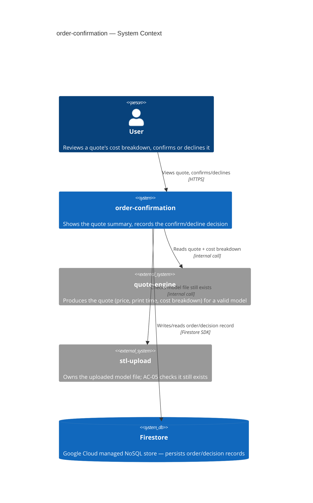
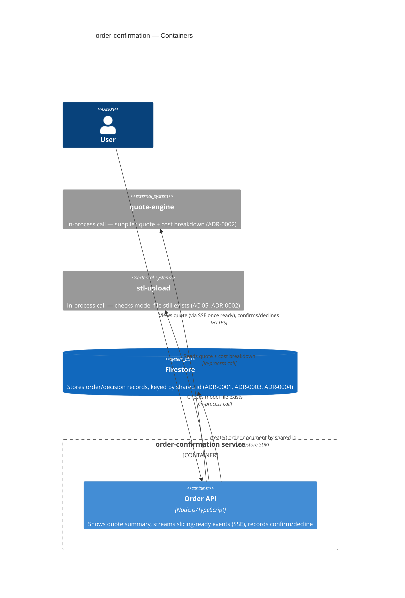
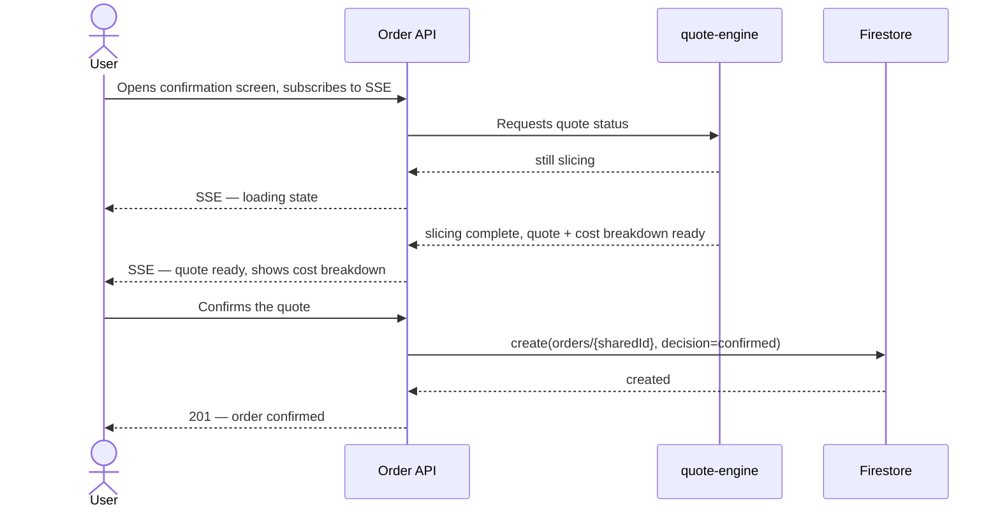
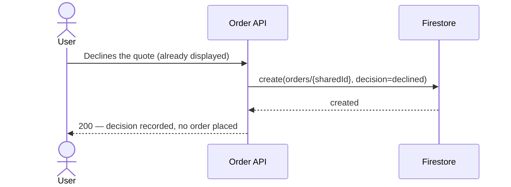
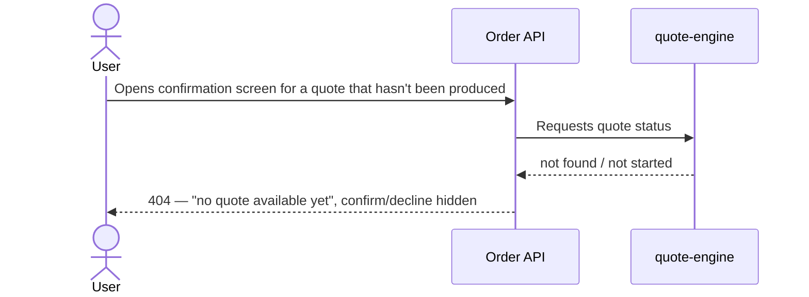
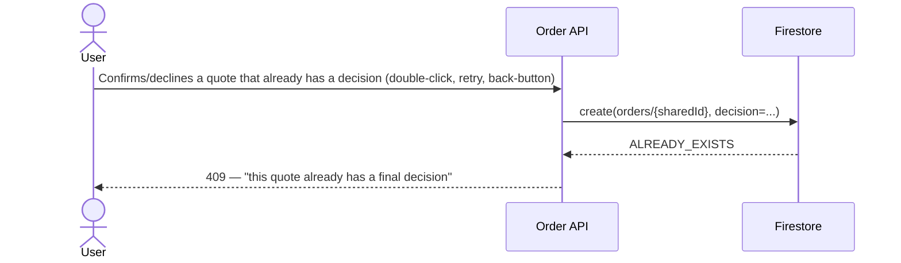
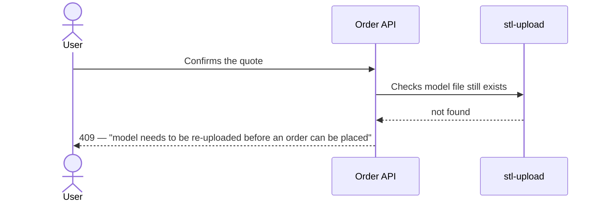

# Software Architecture Document — order-confirmation

<!-- Stages 04-05 → see sdlc/plugin/skills/architecture-design/SKILL.md -->
<!-- 12 Arc42 sections. Empty sections — <!-- N/A: <one-line reason> -->. -->
<!-- C4 Context (L1) lives inline in §3. C4 Container (L2) lives inline in §5. -->

## 1. Introduction and goals

**Intent.** order-confirmation закриває третій, фінальний крок MVP-флоу маркетплейсу (upload → quote → confirm/decline). Після того як quote-engine рахує квоту (ціна, час друку, матеріал, cost breakdown), користувач бачить розбивку ціни й явно підтверджує або відхиляє квоту; рішення зберігається як єдине джерело правди про те, що сталося далі — акаунтів/авторизації в MVP ще немає (PRD §1, §3).

**Top-3 quality goals (1-liners; full scenarios in §10):**

1. Коректність доменного інваріанту — кожна квота отримує рівно одне записане рішення; повторний confirm/decline на ту саму квоту блокується, а не дублюється (AC-04, PRD §6 concurrency safety).
2. Продуктивність запису/читання — p95 запису confirm/decline ≤300 мс; p95 показу підсумку квоти ≤200 мс (PRD §6, дослівно).
3. Доступність — 99.5% щомісячний SLO (PRD §6, дослівно).

**Stakeholders.**

| Role | Interest | Sign-off owner? |
|---|---|---|
| User | Переглядає розбивку ціни, підтверджує/відхиляє квоту (US-01…US-05) | No |
| Tech Lead | Затверджує SAD перед stage 06 | Yes |
| Security Lead | Підтверджує обсяг security review — перший персистентний order-record і перший no-authz surface у флоу (PRD §6.1) | Yes |

## 2. Constraints

**Technical.**
- Node.js + TypeScript — єдине зафіксоване рішення по стеку (`docs/overview.md`, `CLAUDE.md`).
- Жодного framework/datastore/hosting рішення ще не прийнято — відкриті стратегічні вибори, вирішуються у §4/§5, не є попередніми обмеженнями.

**Organisational.**
- Effort budget: орієнтовно ~2 тижні за аналогією з comparably-scoped stl-upload (idea-brief §12), але старт фічі гейтиться не календарною датою, а стабілізацією контракту quote-engine (PRD §1) — це м'якіший дедлайн, ніж у stl-upload.
- Team: solo maintainer, без чергування (той самий власник фічі, що й stl-upload).

**Conventions.**
- `CLAUDE.md` наразі не має код-конвенцій (репозиторій до-коду) — немає готового naming/error-handling патерну для успадкування; stl-upload вже зафіксував перші конвенції (шаровий стиль ADR-0004, UUID v4 ADR-0005) — order-confirmation оцінює їх окремо у §5/§8, не успадковує автоматично.

**Regulatory / external.**
- Дані класифіковані як internal; жодного нового PII не додається понад те, що вже збирають stl-upload/quote-engine (PRD §6.1).
- Security review обов'язковий — перший персистентний order-record у маркетплейсі і перший no-authorization-check поверхневий ризик (PRD §6.1).

## 3. Context and scope

<!-- brownfield: N/A — greenfield repo -->

Після того як quote-engine рахує квоту, користувач переглядає order-confirmation екран з cost breakdown і підтверджує або відхиляє квоту. Рішення (order record) персистентно зберігається у Firestore — керованому NoSQL-сховищі Google Cloud, яке є зовнішньою системою відносно нашого коду (інший власник процесу, інший lifecycle). AC-05 додатково перевіряє, що файл моделі в stl-upload ще існує перед підтвердженням.

**External systems (in / out):**

| Actor or system | Type | Interaction |
|---|---|---|
| User | Person | Переглядає cost breakdown, підтверджує/відхиляє квоту |
| quote-engine | System (internal) | Постачає квоту + cost breakdown, які показує/по яким вирішує ця фіча |
| stl-upload | System (internal) | Власник файлу моделі; AC-05 перевіряє, що файл ще існує |
| Firestore | System_Ext (managed cloud datastore) | Персистентне сховище order/decision-записів — шар персистенції фічі |

**C4 Context (L1):**



## 4. Solution strategy

**Top strategic choices (the seeds for ADRs):**

1. **Firestore як сховище order-записів** — керований NoSQL-стор Google Cloud; немає потреби піднімати/адмініструвати БД-сервер у межах solo-maintainer бюджету (§2), atomic per-document write вкладається в p95 ≤300мс (PRD §6). → ADR-0001.
2. **In-process виклики функцій між order-confirmation, quote-engine, stl-upload** — усі три лишаються модулями одного Node/TS-монолiту (§2, немає окремих деплой-юнітів); повторює вже встановлений прецедент stl-upload↔quote-engine (пряме читання з диска, без HTTP). Уникає зайвої мережевої затримки під бюджет §1 QG-2 (p95 ≤200мс на показ квоти). → ADR-0002.
3. **Наскрізний UUID v4 (file-id → quoteId → order id)** — той самий ідентифікатор, який stl-upload генерує при валідації файлу (ADR-0005 у stl-upload), проходить без змін через слайсинг і фіксується як ID order-документа. Узгоджено з PRD §3 non-goals (немає re-quote — модель:квота:order = 1:1:1). → ADR-0003.
4. **Firestore `create()` як механізм exactly-once для AC-04** — document id = наскрізний id з (3); Firestore атомарно відхиляє повторний `create()` тим самим id (ALREADY_EXISTS), що замінює SQL UNIQUE constraint без додаткового коду блокувань. → ADR-0004.
5. **Server-Sent Events для сигналу готовності квоти** — після stl-upload користувач бачить loading-стан під час слайсингу; SSE штовхає подію «квота готова» з мінімальною затримкою, без full-page reload і без зайвої складності WebSocket для односпрямованого сигналу. → ADR-0005.

**Успадковано з PRD (не перевирішується тут):** авторизація — v1 свідомо без owner-перевірки на confirm/decline (feature owner override, PRD §1 «Decision overrides», PRD §8 open question) — це вже зафіксований, а не новий вибір.

Each tactical decision in later sections should be traceable to one of these strategic seeds. Tactical decisions that *contradict* a strategic choice are red flags — surface them in §11 Risks.

## 5. Building block view

Простий шаровий стиль (routes/services/repositories) — новий модуль у тому ж Node/TS-монолiтi, за прикладом stl-upload ADR-0004: менше файлів/інтерфейсів на старті, узгоджено з 2-тижневим орієнтовним бюджетом solo-maintainer (§2). Не ADR-гідне рішення — внутрішнє планування одного модуля, не міжмодульний контракт.

**Internal decomposition:**

```
src/modules/order-confirmation/
├── routes/        <HTTP: GET quote summary, POST confirm, POST decline, GET SSE stream (ADR-0005)>
├── services/       <confirm/decline use case: читає квоту з quote-engine, перевіряє файл через stl-upload
│                    (ADR-0002 — in-process виклики), пише рішення через repository>
├── repositories/   <Firestore order-repository — create() по shared id (ADR-0001, ADR-0004)>
└── module.ts       <self-wiring>
```

**C4 Container (L2):**



## 6. Runtime view

**Critical flow 1: Happy path — confirm (US-02, AC-01)**



**Critical flow 2: Happy path — decline (US-03, AC-02)**



**Critical flow 3: No quote yet (US-01, AC-03)**



**Critical flow 4: Domain invariant — duplicate confirm/decline blocked (AC-04)**



**Critical flow 5: Model file gone (AC-05)**



## 7. Deployment view

order-confirmation деплоїться в тому ж single Node/TS-процесі, що й stl-upload/quote-engine — прямий наслідок ADR-0002 (in-process виклики вимагають co-location), не окреме ADR-гідне рішення. Один процес на одній VM через systemd/pm2, без контейнерної оркестрації — той самий прецедент, що й stl-upload §7 (§2 solo-maintainer бюджет).

**Monitoring:**
- Latency confirm/decline запису — p95 ≤300мс (PRD §6, дослівно).
- Latency показу квоти — p95 ≤200мс від моменту готовності квоти (PRD §6, дослівно).
- Лічильник відкритих SSE-з'єднань (ADR-0005 Negative — новий операційний параметр).
- Alert: сплеск 409 на confirm/decline (AC-04 duplicate-attempts) — сигнал double-submit-бага чи зловживання (PRD §6.1 spam-create abuse case).

**Scaling thresholds:**
- Один інстанс у v1 — узгоджено з ADR-0002 (in-process) і ADR-0005 (SSE-з'єднання без cross-instance affinity).
- Горизонтальне масштабування вимагає спершу вирішити session-affinity для SSE (ADR-0005 Negative) і, за потреби, розділити модулі на окремі деплой-юніти (переглянути ADR-0002) — задокументовано як accepted debt у §11.

## 8. Crosscutting concepts

<!-- Greenfield: CLAUDE.md ще не має власних logging/auth/error-конвенцій — це свіжі рішення, не override. -->

| Concept | Convention | Where defined |
|---|---|---|
| Logging | Структуровані JSON-логи, поле `request_id`; жодного вмісту рішення понад id/статус | here |
| Authentication | N/A — MVP не має акаунтів, свідомий feature-owner override | PRD §1, §8 |
| Error handling | 404 — немає квоти (AC-03); 409 — повторне рішення (AC-04) або файл відсутній (AC-05); повідомлення без технічного жаргону | here |
| ID strategy | Наскрізний UUID v4, успадкований від stl-upload file-id — новий ID не генерується | ADR-0003 |
| Internationalisation | N/A, лише англійська | — |
| Observability | Latency-метрики + лічильник відкритих SSE-з'єднань | §7 |
| Rate limiting | 10 confirm/decline спроб/хв на сесію | PRD §6.1 |

## 9. Architecture decisions

<!-- 🎯 Навіщо: ЗВОРОТНИЙ ІНДЕКС на папку adr/. `ls adr/` дає файли, §9 дає семантику —    -->
<!--           чому вони існують, до якого зрізу SAD привʼязані, у якому статусі.           -->
<!-- 📋 Що писати: таблиця з 4 колонками. Один рядок на ADR. Mixed status — це OK.         -->
<!-- 📌 Приклад: «0001 | Зберігати урок як таблицю блоків | Accepted | §4».                -->

| # | Title | Status | Section |
|---|---|---|---|
| 0001 | Store order records in Firestore | Accepted | §4 |
| 0002 | Use in-process module calls for order-confirmation integration | Accepted | §4 |
| 0003 | Thread stl-upload's file-id as the shared quote/order id | Accepted | §4 |
| 0004 | Use Firestore document create() for exactly-once decisions | Accepted | §4 |
| 0005 | Use Server-Sent Events for slicing-completion updates | Accepted | §4 |

ADR files live under `docs/features/order-confirmation/adr/NNNN-<title>.md`.

## 10. Quality requirements

**QG-1. Коректність доменного інваріанту (AC-04)**
- **When:** два запити confirm/decline надходять на ту саму квоту (подвійний клік, retry, back-button).
- **Then:** записується рівно одне рішення; другий запит відхиляється — «duplicate confirm/decline on the same quote is rejected, not double-recorded» (PRD §6, дослівно).
- **How verify:** інтеграційний тест — два конкурентних `POST /confirm` на той самий quoteId, перевірка: рівно один Firestore-документ створено, рівно одна відповідь 409.

**QG-2. Продуктивність запису/читання**
- **When:** користувач підтверджує/відхиляє квоту під нормальним навантаженням.
- **Then:** p95 запису confirm/decline ≤300 мс; p95 показу підсумку квоти ≤200 мс (PRD §6, дослівно).
- **How verify:** k6 load test при ≥20 req/s на інстанс (PRD §6, дослівно), вимірюються обидва p95.

**QG-3. Доступність**
- **When:** штатна робота фічі протягом місяця.
- **Then:** 99.5% щомісячний SLO (PRD §6, дослівно).
- **How verify:** uptime/SLO dashboard, що трекає відношення успішних confirm/decline до 5xx помилок за місяць.

## 11. Risks and technical debt

<!-- N/A: greenfield — no brownfield gotchas from Explore report -->

| Risk / debt | Severity | Mitigation | Owner |
|---|---|---|---|
| quote-engine ще не спроєктований — контракт «quoteId = stl-upload file-id» (ADR-0003) потребує підтвердження на власному architecture-design проході quote-engine | Medium | Підтвердити під час quote-engine stage 04-05; до того — прийняте припущення | Yakiv Vakoliuk |
| Відкриті SSE-з'єднання на інстанс обмежують горизонтальне масштабування (ADR-0005 Negative) | Low | Переглянути при переході на кілька інстансів — session affinity або перехід на polling | Yakiv Vakoliuk |
| Stale-price confirm — немає staleness/expiry перевірки квоти у v1 (PRD §1 override, §6.1) | Medium | Свідомо прийнятий ризик; переглянути після запуску за сигналами скарг на ціну | Yakiv Vakoliuk |
| Orphaned file reference — модель може бути видалена stl-upload retention policy вже ПІСЛЯ підтвердження order (AC-05 перевіряє лише в момент рішення, ADR-0002 live-check не покриває «після») | Medium | Flagged для наступного перегляду — можливе рішення: retention guarantee в stl-upload або snapshot у order-confirmation | Yakiv Vakoliuk |
| Немає authorization-перевірки на confirm/decline у v1 (PRD §1 feature-owner override) | Medium | Свідомо прийнятий ризик, узгоджено з відсутністю акаунтів у MVP | Yakiv Vakoliuk |
| Open architectural decision: quote-engine's final output contract (price/print time/material/breakdown/file reference) | Open question | Resolve before quote-engine ships / stage 09 api-contracts (PRD §8) | Yakiv Vakoliuk |

**Resolved by this SAD:**
- PRD §8's "no-authz check acceptable for v1?" open question (due: before architecture-design, i.e. this stage) is **closed as-is**: this SAD reaffirms the feature-owner's PRD §1 override — no ownership/authorization check ships in v1 — as the standing decision for this architecture pass; it is not re-opened or re-litigated here.
- PRD §8's "stl-upload retention guarantee vs. order-confirmation snapshot" open question is answered — AC-05 and §6 flow 5 already specify a **live check** against stl-upload at confirm time, not a snapshot; this is what makes AC-05's "re-upload" messaging coherent. (Not an ADR-0002 concern — ADR-0002 only decided in-process vs. HTTP call style, not the snapshot-vs-live-check axis.)

**Accepted debt (acceptable in v1, plan to fix later):**
- Firestore `create()`-only pattern (ADR-0004) does not support future decision revision — a future release needing edit/re-decide must migrate to a transaction-based pattern.
- SSE reconnection/heartbeat is not handled for very long slicing jobs (ADR-0005 Neutral) — acceptable while slicing times stay short.
- Layered style (§5) may need refactor into clearer boundaries if the module grows beyond its current confirm/decline scope — same caveat as stl-upload ADR-0004.

## 12. Glossary

| Term | Meaning |
|---|---|
| Order | Запис рішення користувача (confirm/decline) на квоту. NOT quote (квота — пропозиція, order — вже прийняте рішення) — CONTEXT.md. |
| Quote | Цінова пропозиція (час друку + матеріал + ціна), яку рахує quote-engine зі слайсингу валідної моделі. NOT order — CONTEXT.md. |
| Cost breakdown | Розкладка фінальної ціни квоти на компоненти. NOT quote (квота — вся пропозиція, breakdown — лише розклад ціни всередині неї) — CONTEXT.md. |
| User | Особа, яка завантажує модель для друку і приймає рішення confirm/decline. NOT vendor — CONTEXT.md. |
| Model | 3D-об'єкт, який користувач хоче надрукувати. NOT STL file — CONTEXT.md. |
| STL file | Формат файлу, що кодує поверхню моделі як набір трикутників; order-confirmation перевіряє лише його наявність (AC-05), не вміст. NOT model — CONTEXT.md. |
| Shared id / quoteId | Наскрізний UUID v4, згенерований stl-upload як file-id (ADR-0005 у stl-upload) і використаний без змін як quoteId і Firestore document id ордера (ADR-0003, ADR-0004). Не в CONTEXT.md — флаг для `sdlc:fix-term`. |
| Slicing | Процес, у якому quote-engine рахує квоту з валідної моделі (тривалість непередбачувана, вимагає SSE/loading-стану, ADR-0005). Не в CONTEXT.md — флаг для `sdlc:fix-term`. |

<!-- "Shared id / quoteId" і "Slicing" surfaced during this pass — flag for sdlc:fix-term follow-up. -->
