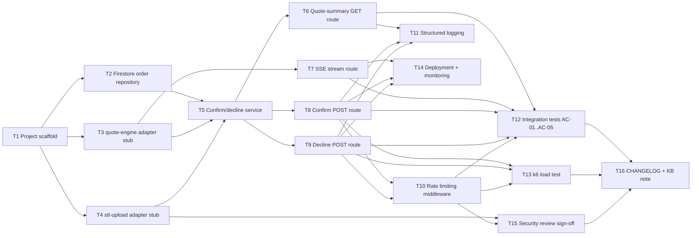

# Task breakdown — order-confirmation

<!-- Stage 13 → see sdlc/plugin/skills/break-tasks/SKILL.md -->

## Upstream artefacts

- [PRD](../PRD.md) — AC-01..AC-05, §6 NFR, §6.1 Security/privacy, §8 Open questions
- [SAD](../sad.md) — §5 Building block view, §6 Runtime view (flows 1-6), §7 Deployment, §8 Crosscutting, §9 ADR index, §10 Quality requirements
- ADRs: [0001](../adr/0001-store-order-records-in-firestore.md) Firestore storage (Accepted) · [0002](../adr/0002-use-in-process-module-calls-for-order-confirmation-integration.md) in-process module calls (Accepted) · [0003](../adr/0003-thread-stl-uploads-file-id-as-the-shared-quote-order-id.md) shared UUID v4 id (Accepted) · [0004](../adr/0004-use-firestore-document-create-for-exactly-once-decisions.md) `create()` exactly-once (Accepted) · [0005](../adr/0005-use-server-sent-events-for-slicing-completion-updates.md) SSE for slicing updates (Accepted)
- [data-model.md](../data-model.md) — single `orders` collection, doc id = shared id, fields `decision`/`decided_at`/`model_file_ref`

## Scope note — cross-feature blocker

Per ADR-0002, order-confirmation calls quote-engine and stl-upload **in-process** — but neither module exists in `src/` yet (`src/modules/` currently holds only an empty `order-confirmation` skeleton; quote-engine has no PRD/SAD/ADR at all, per project `CLAUDE.md`). Two consequences for the tasks below:

- T3 (quote-engine adapter) and T4 (stl-upload adapter) can only build a **typed port + stub/fake** against the shape SAD §5/§6 currently assumes. Real wiring to the actual modules is blocked until those modules ship — tracked as SAD §11 risk ("quote-engine ще не спроєктований") and PRD §8 open question (quote-engine's final output contract, due before quote-engine ships / stage 09 api-contracts).
- No `openapi.yaml` exists for order-confirmation (api-forge/stage 10 hasn't run for this feature, unlike stl-upload). Route tasks (T6-T9) take their request/response shape from SAD §6 sequence diagrams and PRD AC status codes, not from a formal contract — flagged as a gap to close once api-forge runs for this feature.

Out of scope for this breakdown (explicitly deferred by PRD §3/§1 overrides): quote staleness/expiry checks, authorization/ownership checks, payments, order fulfillment, decision reversal. Do not create implementation tasks for these until a future PRD revision lifts the non-goal.

## Dependency graph

## Tasks

| ID | Title | Deps | Estimate | Owner |
|----|-------|------|----------|-------|
| T1 | Project scaffold + module skeleton (SAD §5) | — | S | Yakiv Vakoliuk |
| T2 | Firestore order repository (ADR-0001, ADR-0004) | T1 | S | Yakiv Vakoliuk |
| T3 | quote-engine adapter + stub (ADR-0002) | T1 | S | Yakiv Vakoliuk |
| T4 | stl-upload adapter + stub (ADR-0002, AC-05) | T1 | S | Yakiv Vakoliuk |
| T5 | Confirm/decline domain service (SAD §5 `services/`) | T2, T3, T4 | M | Yakiv Vakoliuk |
| T6 | Quote-summary GET route (AC-03, US-04) | T5 | S | Yakiv Vakoliuk |
| T7 | SSE stream route (ADR-0005) | T3 | S | Yakiv Vakoliuk |
| T8 | Confirm POST route (AC-01, AC-04, AC-05) | T5 | S | Yakiv Vakoliuk |
| T9 | Decline POST route (AC-02, AC-04) | T5 | S | Yakiv Vakoliuk |
| T10 | Rate limiting middleware (PRD §6.1) | T8, T9 | S | Yakiv Vakoliuk |
| T11 | Structured logging (SAD §8) | T6, T8, T9 | XS | Yakiv Vakoliuk |
| T12 | Integration tests — AC-01..AC-05 | T6, T7, T8, T9, T10 | S | Yakiv Vakoliuk |
| T13 | k6 load test (PRD §6 NFR) | T8, T9, T10 | S | Yakiv Vakoliuk |
| T14 | Deployment config + monitoring (SAD §7) | T7, T8, T9 | S | Yakiv Vakoliuk |
| T15 | Security review sign-off (PRD §6.1) | T4, T10 | S | Security Lead |
| T16 | CHANGELOG + KB note | T12, T13, T15 | XS | Yakiv Vakoliuk |

## Estimation legend

- XS: ≤2h
- S: ≤1d
- M: 1-2d (borderline — consider splitting)
- L: must be split, ≤1d did not work out
