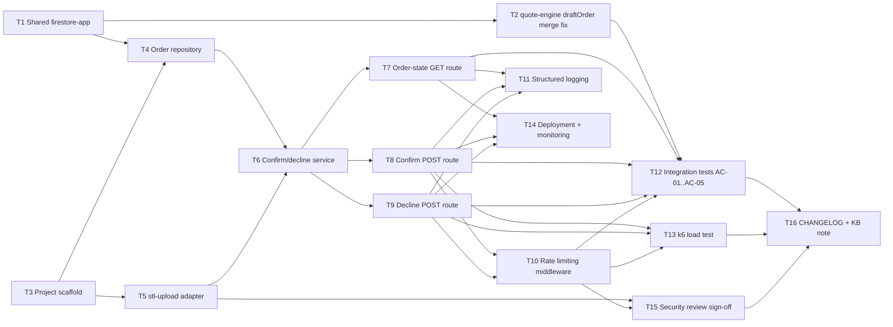

# Task breakdown — order-confirmation

<!-- Stage 13 → see sdlc/plugin/skills/break-tasks/SKILL.md -->
<!-- Regenerated 2026-10-03 against the sad.md revision (commit 834ce68) that replaced the
     pre-quote-engine design (dedicated orders collection, in-process quote-engine call, SSE push)
     with the shipped quote-engine contract (shared draftOrders/{fileId} doc, no quote-engine call,
     no SSE). The 2026-09-13 breakdown this supersedes assumed quote-engine and stl-upload did not
     exist yet; both have since landed (CHANGELOG.md), so T1-T16 below build against real modules,
     not stubs. -->

## Upstream artefacts

- [PRD](../PRD.md) — AC-01..AC-05, §6 NFR, §6.1 Security/privacy, §8 Open questions
- [SAD](../sad.md) — §3 Context (revised), §4 Solution strategy (revised), §5 Building block view (revised), §6 Runtime view (6 flows, revised), §7 Deployment (revised), §9 ADR index, §10 Quality requirements, §11 Risks
- ADRs: [0003](../adr/0003-thread-stl-uploads-file-id-as-the-shared-quote-order-id.md) shared UUID v4 id (Accepted, confirmed against real contract) · [0006](../adr/0006-record-decisions-on-quote-engines-draftorders-document.md) decisions on `draftOrders/{fileId}` (Accepted) · [0007](../adr/0007-firestore-transaction-with-decision-precondition-for-exactly-once.md) transaction precondition (Accepted) · [0008](../adr/0008-scope-in-process-calls-to-stl-upload-only.md) in-process scope narrowed to stl-upload (Accepted). ADR-0002 stands, narrowed by 0008. ADR-0001, 0004, 0005 are Superseded — not used below.
- [`docs/features/quote-engine/kb-quote-contract.md`](../../quote-engine/kb-quote-contract.md) — the real `draftOrders` document shape and WebSocket protocol this breakdown builds against, in place of the stale `data-model.md`.

## Known gap — data-model.md is stale, not rewritten here

`docs/features/order-confirmation/data-model.md` (stage 08, 2026-09-13) still describes a dedicated `orders` collection with `create()`-based exactly-once — superseded by ADR-0006/0007's shared `draftOrders/{fileId}` document and transaction. Rewriting it is a stage-08 (`sdlc:generate-data-model`) concern, out of this stage-13 skill's scope. Task files below link directly to SAD §5/§9 and ADR-0006/0007 instead of `data-model.md` so they don't inherit the stale shape. Flagging this explicitly so the gap isn't silently carried forward — recommend a `sdlc:generate-data-model` re-run before/alongside this epic.

## Known gap — sad.md is still Draft, not Accepted

Per SAD §1's stakeholders table, Tech Lead and Security Lead sign-off are required before stage 06. `sad.md` frontmatter still reads `status: Draft`. This breakdown proceeds on the user's explicit instruction, but **tickets should not move past "Not started" until sad.md is formally Accepted** — otherwise T3-T16 risk building against an architecture that could still change under review.

## Scope note — cross-module touches, and a High-severity risk this breakdown surfaces but cannot close alone

Per ADR-0006/0008, order-confirmation no longer calls quote-engine in-process — it only shares a Firestore document and (per §5) a new `src/shared/firestore-app.ts` singleton. Two consequences:

- **T1** and **T2** touch quote-engine's already-shipped `src/modules/quote-engine/repositories/quote-repository.ts`, not just `order-confirmation/`'s own tree. Both are scoped narrowly (extract one `initializeApp()` call; change one `.set()` call to `.set(..., {merge: true})`) and each needs quote-engine's own existing test suite (quote-engine T13) to stay green, not just order-confirmation's tests.
- **T2 fixes a High-severity risk SAD §11 explicitly declines to resolve unilaterally**: quote-engine's `writeDraftOrder` currently does a non-merge `.set()`, so a re-quote of the same `fileId` after a confirm/decline silently erases `decision`/`decidedAt` and reopens an already-decided quote — directly undermining AC-04/QG-1. SAD §11 says this "needs a quote-engine-side fix... out of this SAD's scope to decide unilaterally; raise with quote-engine's owner before either feature ships." Since both modules share one owner (Yakiv Vakoliuk) in this repo, T2 is included as a task here rather than left unassigned — **but treat it as a decision requiring the same sign-off as any other quote-engine change, not just an order-confirmation implementation detail.**
- **T5** adds one new exported function to stl-upload's `repositories/model-repository.ts` (`modelExists`) — stl-upload currently exports no existence check, only `saveModel`. This is the one call ADR-0008 explicitly keeps in-process; no stl-upload PRD/SAD change is implied.

Out of scope for this breakdown (explicitly deferred by PRD §3/§1 overrides): quote staleness/expiry checks, authorization/ownership checks, payments, order fulfillment, decision reversal. Do not create implementation tasks for these until a future PRD revision lifts the non-goal. Also out of scope: resolving SAD §11's "QG-2 display-latency NFR has no step left to measure in this module" open question — that is a PM/architecture decision (PRD retarget or SAD re-confirmation), not an engineering task; flagged for the Tech Lead at stage 06 sign-off.

## Dependency graph

## Tasks

| ID | Title | Deps | Estimate | Owner |
|----|-------|------|----------|-------|
| T1 | Shared `firestore-app.ts` singleton (SAD §5) | — | S | Yakiv Vakoliuk |
| T2 | Fix quote-engine `draftOrders` merge-safety (SAD §11 High risk, ADR-0007 consequence) | T1 | S | Yakiv Vakoliuk |
| T3 | Project scaffold + module skeleton (SAD §5) | — | S | Yakiv Vakoliuk |
| T4 | Order repository over `draftOrders` (ADR-0006, ADR-0007) | T1, T3 | M | Yakiv Vakoliuk |
| T5 | stl-upload adapter — real `modelExists` check (ADR-0002/0008, AC-05) | T3 | S | Yakiv Vakoliuk |
| T6 | Confirm/decline domain service (SAD §5 `services/`) | T4, T5 | M | Yakiv Vakoliuk |
| T7 | Order-state GET route (AC-03, AC-04, US-04, flows 3/4/6) | T6 | S | Yakiv Vakoliuk |
| T8 | Confirm POST route (AC-01, AC-04, AC-05, flow 1) | T6 | S | Yakiv Vakoliuk |
| T9 | Decline POST route (AC-02, AC-04, flow 2) | T6 | S | Yakiv Vakoliuk |
| T10 | Rate limiting middleware (PRD §6.1) | T8, T9 | S | Yakiv Vakoliuk |
| T11 | Structured logging (SAD §8) | T7, T8, T9 | XS | Yakiv Vakoliuk |
| T12 | Integration tests — AC-01..AC-05 + QG-1 concurrency | T2, T7, T8, T9, T10 | S | Yakiv Vakoliuk |
| T13 | k6 load test (PRD §6 NFR, QG-2) | T8, T9, T10 | S | Yakiv Vakoliuk |
| T14 | Deployment config + monitoring (SAD §7) | T7, T8, T9 | S | Yakiv Vakoliuk |
| T15 | Security review sign-off (PRD §6.1) | T5, T10 | S | Security Lead |
| T16 | CHANGELOG + KB note | T12, T13, T15 | XS | Yakiv Vakoliuk |

## Estimation legend

- XS: ≤2h
- S: ≤1d
- M: 1-2d (borderline — consider splitting)
- L: must be split, ≤1d did not work out
