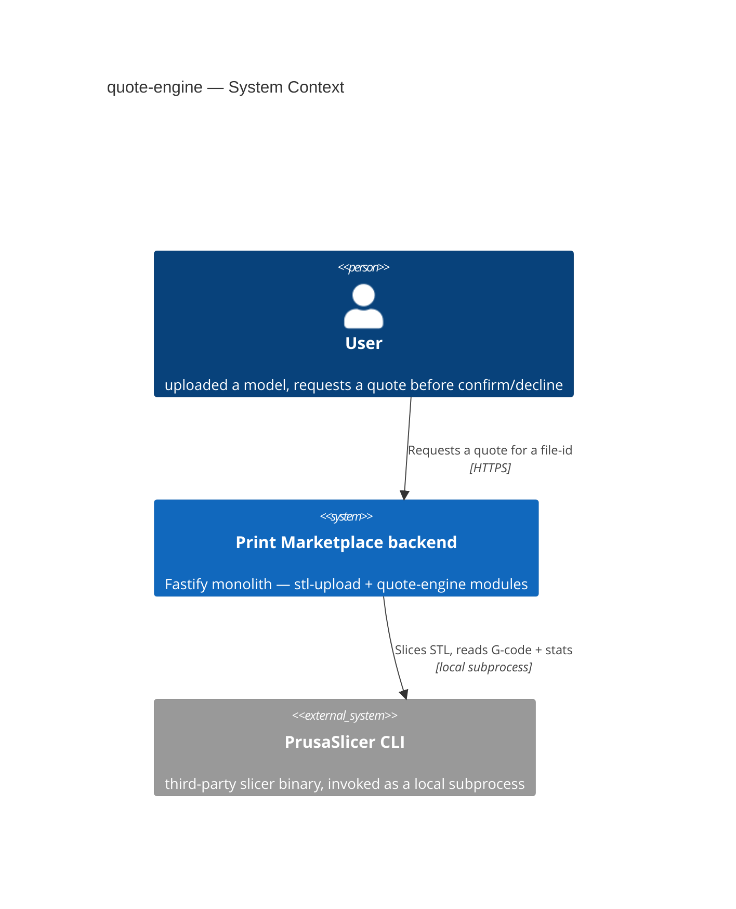
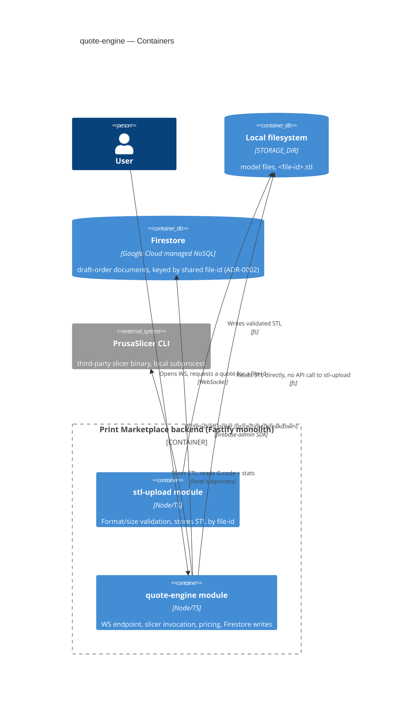
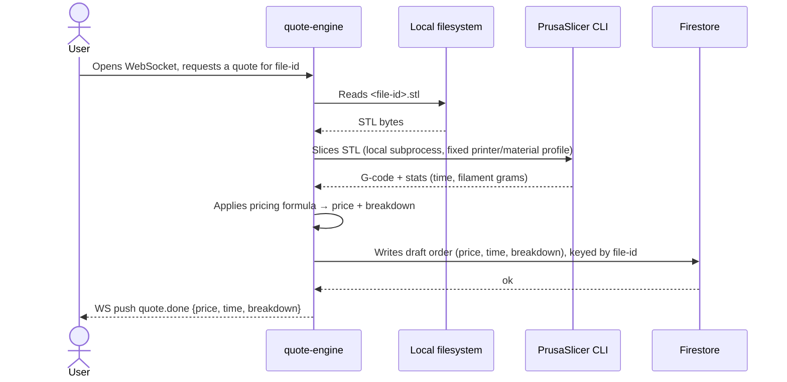
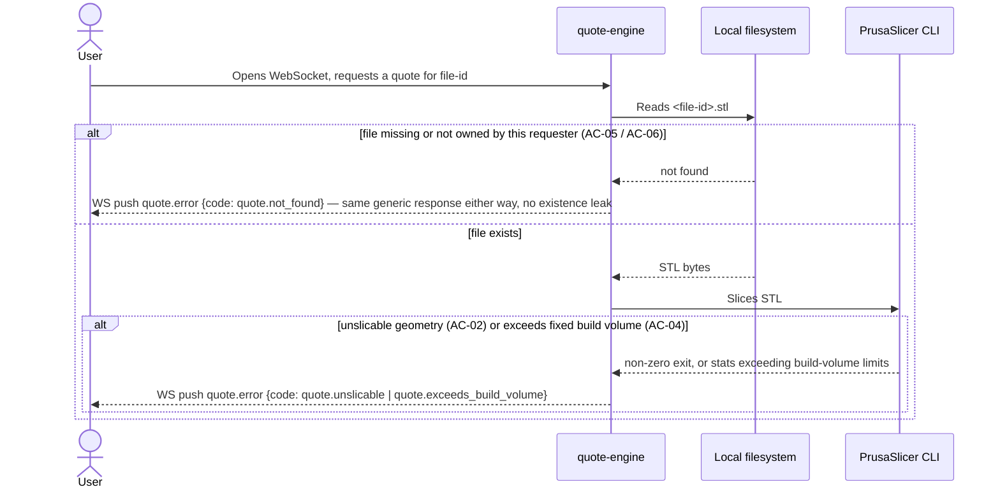

# Software Architecture Document — quote-engine

<!-- Stages 04-05 → see sdlc/plugin/skills/architecture-design/SKILL.md -->
<!-- 12 Arc42 sections. Empty sections — <!-- N/A: <one-line reason> -->. -->
<!-- C4 Context (L1) lives inline in §3. C4 Container (L2) lives inline in §5. -->
<!-- Заповнений приклад: див examples/course-lesson-mvp/sad.md у sdlc/ toolkit. -->

## 1. Introduction and goals

**Intent.** quote-engine turns a previously uploaded, validated STL model into an exact print quote by actually invoking PrusaSlicer CLI against one fixed printer+material configuration (Approach A, idea-brief §13) — real slice time and real material usage, not a weight-based estimate — then applies a configurable pricing formula to produce a price with a cost breakdown. It blocks clearly, instead of hanging or crashing, when a model can't be sliced, exceeds the fixed printer's build volume, or is no longer available in storage. It is the hard blocking dependency for order-confirmation, the next MVP flow step (PRD §1).

**Top-3 quality goals (1-liners; full scenarios in §10):**

1. Price accuracy — quoted price within ±5% of real print cost (PRD §6 NFR); a miss is a direct financial loss, not a UX defect.
2. Quote turnaround — p95 ≤ 60s end-to-end, including slicer wall-clock (PRD §6 NFR).
3. Graceful handling of bad input — unslicable, oversized, or missing models are blocked with a clear message, never a hang or crash (AC-02, AC-04, AC-05).

**Stakeholders.**

| Role | Interest | Sign-off owner? |
|---|---|---|
| user | gets an exact price/time to decide confirm or decline (US-01) | No |
| Product Owner (Yakiv Vakoliuk) | confirms the pricing formula and rates before launch (PRD §8 open question) | No |
| Tech Lead | SAD approval | Yes |
| Security Lead | reviews untrusted-STL-to-subprocess handling (PRD §6.1) | Yes |

## 2. Constraints

**Technical.**
- Node.js ≥20, TypeScript 6.0.3 (ESM, `"type": "module"`), Fastify 5.12.5.
- `@fastify/multipart`, `@fastify/static` already in use (stl-upload); no new HTTP-layer dependency expected.
- Filesystem-only persistence — no database, no accounts (CLAUDE.md, confirmed by Explore scan: no Prisma/Drizzle/SQL anywhere in repo).
- Layered convention: `routes/` → `services/` → `repositories/`, per ADR-0004 (stl-upload).
- New dependency: PrusaSlicer CLI, invoked as an untrusted-input subprocess (stl-parse-feature-plan.md). **No version pinned anywhere in the repo yet** — flagged as a risk in §11 (ties to stl-parse-feature-plan.md human checkpoint #1: wrapper not yet verified against real .stl files).

**Organisational.**
- Solo maintainer (Yakiv Vakoliuk), no on-call (inherited from stl-upload, PRD §6 Availability row).
- No hard external deadline — quote-engine is simply the only remaining blocker before further MVP progress (PRD §1; idea-brief §4).

**Conventions.**
- `CLAUDE.md` — project conventions.
- `{code, message}` error-sentinel shape, e.g. `upload.invalid_format` — quote-engine mints its own `quote.*` codes in the same shape.
- `SAFE_FILE_ID` path-safety regex pattern (`model-repository.ts`) — any file-id touching the filesystem must be validated this way.
- UUID v4 file-id (ADR-0005) — explicitly a cross-module contract; quote-engine reads this id, does not mint its own.

**Regulatory / external.**
- PRD §6.1: STL bytes are untrusted input to a subprocess — no shell interpolation of filenames/paths (same discipline as `SAFE_FILE_ID`).
- PRD §6.1: quote requests for an unrecognized or not-owned file-id get the same generic response as a malformed one (AC-06, enumeration resistance).

## 3. Context and scope

Quote-engine is a module inside the existing Print Marketplace Fastify monolith. A user who already uploaded a valid STL (stl-upload module) requests a quote for it; quote-engine slices that model via a local PrusaSlicer CLI subprocess and returns a price, print time, and material breakdown — or a clear blocking error if the model can't be sliced, exceeds the fixed printer's build volume, or no longer exists.

**External systems (in / out):**

| Actor or system | Type | Interaction |
|---|---|---|
| user | Person | Requests a quote for a previously uploaded model's file-id |
| PrusaSlicer CLI | System (external, local subprocess) | Receives STL + fixed printer/material profile, returns G-code + slicing stats via stdout, or a non-zero exit on unslicable/oversized geometry |

**C4 Context (L1):**



## 4. Solution strategy

**Top-3 strategic choices (the seeds for ADRs):**

1. **WebSocket push for the quote result** (ADR-0001) — the browser opens a WebSocket for a quote request and the server pushes `quote.done` / `quote.error` when the up-to-60s PrusaSlicer subprocess finishes, instead of holding an HTTP connection open or polling. Avoids the HTTP/proxy-timeout risk of a 60s blocking request while staying simpler than building a job-store + polling endpoint. Requires a new `@fastify/websocket` dependency and a new client-side pattern in `src/ui/`.

2. **Concurrency control for the shared PrusaSlicer subprocess** — deliberately left open (see §11 "Open architectural decision: concurrency model for PrusaSlicer invocations"). Candidates considered: an in-process FIFO queue with a single worker (zero new infra, matches the NFR's "≥1 concurrent, rest queue" literally) vs. a bounded worker pool (more throughput, more complexity the NFR doesn't currently require). Resolve before `sdlc:break-tasks` — this gates §7 Deployment's scaling-threshold wording.

3. **Persist the quote as a Firestore draft order, reusing order-confirmation's shared id** (ADR-0002) — quote-engine writes the computed price/time/breakdown into Firestore keyed by the same UUID v4 file-id that stl-upload minted and order-confirmation already expects to reuse (order-confirmation ADR-0003), so order-confirmation's later confirm step can act on an existing draft instead of re-deriving the quote. **This is a deliberate, explicit override of order-confirmation's own already-Accepted architecture** (ADR-0001 Firestore-for-orders-only, ADR-0002 in-process live recomputation, ADR-0004 exactly-once-via-`create()`, and data-model.md's "No persisted quote snapshot") — the product owner chose to proceed with Firestore-at-quote-time now and revisit order-confirmation's docs afterward, rather than follow the already-accepted "stateless, recompute live" design. Tracked as a High-severity risk in §11, not an open question, because the decision itself is made — the follow-up rework is the open item.

Each tactical decision in later sections should be traceable to one of these strategic seeds. Tactical decisions that *contradict* a strategic choice are red flags — surface them in §11 Risks.

**Decision overrides (¶4):** the Firestore-persistence choice above (strategic choice 3 / ADR-0002) knowingly contradicts order-confirmation's already-Accepted ADR-0001/0002/0004 and data-model.md. Recorded here per the critic-phase override convention so downstream skills (`sdlc:generate-data-model`, `sdlc:break-tasks`) see this was a deliberate choice, not a missed cross-feature read. See §11 for the required order-confirmation follow-up.

## 5. Building block view

Simple layered style (routes → services → repositories), following the precedent set in stl-upload (ADR-0004). quote-engine is a new, self-contained module alongside stl-upload in the same Fastify monolith — no hexagonal/ports-and-adapters split, consistent with the existing single-module-count rationale in that ADR.

**Internal decomposition:**

```
src/modules/quote-engine/
├── module.ts                  <FastifyPluginAsync — registers WS route + rate limit>
├── routes/
│   ├── quote-routes.ts        <WS handshake, delegates to quote-service>
│   └── rate-limit.ts          <reuse stl-upload's pattern, own counter>
├── services/
│   ├── quote-service.ts       <orchestrates: validate file-id → slice → parse → price → persist>
│   ├── slicer-service.ts      <PrusaSlicer CLI subprocess wrapper, timeout>
│   ├── gcode-parser.ts        <stdout/G-code → {time_minutes, filament_grams}>
│   └── pricing-service.ts     <config-driven formula → {total_price, breakdown}>
└── repositories/
    ├── model-reader.ts        <reads <file-id>.stl from shared STORAGE_DIR, SAFE_FILE_ID-checked>
    └── quote-repository.ts    <Firestore draft-order writes, ADR-0002>
```

**C4 Container (L2):**



## 6. Runtime view

**Critical flow 1: Happy path — AC-01 (exact quote returned)**



**Critical flow 2: Blocked quote — AC-02 / AC-04 / AC-05 / AC-06 (generic blocking error)**



<!-- Only 2 of the 5 AC-mapped flows drawn, per explicit user choice during the Socratic walk — on the low end of the 3-5 range typical for M-size, but still meets the "happy-path + ≥1 failure-mode flow" floor. -->

## 7. Deployment view

quote-engine deploys inside the same single Fastify process as stl-upload — no new deploy unit. **Scaling threshold: single instance only, as long as the PrusaSlicer-concurrency mechanism (§11 open architectural decision) ends up being the in-memory FIFO-queue option** — a second instance would run its own independent queue and have no visibility into the first instance's in-flight slice, defeating the "≥1 concurrent, rest queue" NFR guarantee across instances. If the open decision instead resolves to an external job queue (e.g. BullMQ+Redis), this threshold is lifted — but that is not decided yet.

**Monitoring:**
- Metrics — extend `src/metrics.ts`'s existing Prometheus pattern with: `quote_slice_duration_seconds` (histogram, buckets to 60s+Inf, mirrors the existing `http_request_duration_seconds` bucket shape), `quote_slicer_queue_depth` (gauge), `quote_slicer_exit_code` (counter, labeled by exit code).
- Alerts — queue depth sustained >5 for >2 min (approaching the "additional requests queue rather than fail" NFR's breaking point); slicer wall-clock p95 approaching the 60s NFR target.
- Tracing — none beyond existing Fastify request logging (`src/request-logging.ts`); no OpenTelemetry in this repo.

**Scaling thresholds:**
- Single instance only, pending resolution of the concurrency-model open decision (§11).
- No table/row-count scaling concern — quote-engine has no relational storage; Firestore draft-order writes scale with request volume, not with any schema-level ceiling.

<!-- Not N/A — this feature does change deployment-relevant scaling guidance (single-instance ceiling), even though the deploy unit itself is unchanged. -->

## 8. Crosscutting concepts

| Concept | Convention | Where defined |
|---|---|---|
| Logging | Fastify built-in logger, same as stl-upload; silenced in tests unless a logStream is passed | `src/request-logging.ts` |
| Authentication | None — no accounts in MVP; the UUID v4 file-id is the sole access control (stl-upload ADR-0005) | CLAUDE.md, stl-upload ADR-0005 |
| Error handling | `{code, message}` sentinel, quote-engine mints `quote.*` codes (`quote.not_found`, `quote.unslicable`, `quote.exceeds_build_volume`, `quote.rate_limited`) | stl-upload `routes/upload-routes.ts` pattern |
| ID strategy | No new id minted — reuses stl-upload's UUID v4 file-id end-to-end as quoteId (order-confirmation ADR-0003) | stl-upload ADR-0005, order-confirmation ADR-0003 |
| Rate limiting | In-memory per-IP fixed-window limiter, own counter instance, same shape as `rate-limit.ts` | stl-upload `routes/rate-limit.ts` pattern |
| Subprocess safety | PrusaSlicer invoked via `child_process` with an argument array (never a shell string) — no shell interpolation of filenames/paths, same discipline as `SAFE_FILE_ID` | PRD §6.1 |
| Credential management | **New in this repo**: Firestore service-account key loaded from an env var (e.g. `FIRESTORE_CREDENTIALS_JSON`), never committed; first credential-bearing dependency in the codebase | CLAUDE.md security rules (secrets never hardcoded) |
| Internationalisation | N/A, English only | — |
| Observability | Prometheus metrics only (no OpenTelemetry anywhere in repo) — see §7 | `src/metrics.ts` |

## 9. Architecture decisions

| # | Title | Status | Section |
|---|---|---|---|
| 0001 | Push the quote result to the browser over WebSocket instead of a blocking HTTP request | Accepted | §4 |
| 0002 | Persist the computed quote to Firestore as a draft order, keyed by the shared file-id | Accepted | §4 |

ADR files live under `docs/features/quote-engine/adr/NNNN-<title>.md`.

## 10. Quality requirements

Each top-3 goal from §1 expanded into a full scenario:

**QG-1. Price accuracy**
- **When:** a valid model receives a quote from the fixed printer+material configuration.
- **Then:** the quoted price deviates ≤ ±5% from real print cost (PRD §6 NFR, verbatim).
- **How verify:** calibration sample of fixed-configuration prints (PRD §6 NFR measurement column) — compare quoted vs. actual material/time cost per sample print, assert deviation ≤5%. **Sample size TBD** — not specified in PRD; a concrete number is a `sdlc:plan-tests` detail, not an architectural decision.

**QG-2. Quote turnaround**
- **When:** a valid model requests a quote.
- **Then:** end-to-end latency (including real PrusaSlicer wall-clock) is p95 ≤ 60s (PRD §6 NFR, verbatim).
- **How verify:** `quote_slice_duration_seconds` Prometheus histogram (§7); k6 load test matching the existing CI smoke-test pattern (`.github/workflows/ci.yml`), asserting the p95 bucket.

**QG-3. Graceful handling of bad input**
- **When:** a quote is requested for a model that is unslicable, exceeds the fixed build volume, no longer exists, or isn't owned by the requester (AC-02, AC-04, AC-05, AC-06).
- **Then:** the system pushes a `quote.error` WS message with the matching `quote.*` code — never a hang, timeout, or crash.
- **How verify:** integration tests per AC with fixture files (non-watertight STL, oversized STL, missing file-id, foreign file-id) — assert the correct error code is pushed and no WS connection is left open past the request.

## 11. Risks and technical debt

<!-- 🎯 Навіщо: ⭐ збирає ВСЕ, що може зламатись — і не лише технічне. Без §11 ризики   -->
<!--           обговорюються на стендапах і губляться; борг лишається у голові того,    -->
<!--           хто його прийняв.                                                          -->
<!-- 📋 Що писати: таблиця ризик/борг — серйозність — мітигація — власник. Технічний    -->
<!--           борг окремою секцією.                                                      -->
<!-- 📌 Приклад: «EM не пушить — member не оновлює дані | High | …». Перший ризик —      -->
<!--           часто продуктовий, не технічний. Це нормально.                            -->

<!-- Severity column literals: Low / Medium / High for regular risks; "Open question" for rows
     created by Step-7 `Save as Open Question` resolutions (see references/socratic-loop.md). -->

| Risk / debt | Severity | Mitigation | Owner |
|---|---|---|---|
| <e.g. Outbox lag may reach hours during downstream outage> | Medium | <Alert >10 min, on-call playbook, retry backoff> | <DevOps> |
| <e.g. No event schema versioning in v1> | Medium | <ADR-NNNN planned for v2, graceful handling of unknown fields> | <Backend> |
| Open architectural decision: <decision-headline> | Open question | Resolve before <stage trigger or YYYY-MM-DD>; <inline rationale from Step-7 Save-as-OQ> | <owner> |

**Accepted debt (acceptable in v1, plan to fix later):**
- <e.g. Goal entity is not versioned (immutable) — OK for v1, may need audit versioning in v2>

## 12. Glossary

<!-- 🎯 Навіщо: ⭐ СЛОВНИК ДОМЕНУ, який припиняє суперечки через рік («checkpoint —      -->
<!--           weekly чи biweekly? Quarter — календарний чи фіскальний?»).                -->
<!-- 📋 Що писати: таблиця термін / значення. Бізнес-терміни + технічні вперемішку.       -->
<!--           Один термін може мати дві мови у заголовку: «Goal (Обʼєктив)».              -->
<!-- 📌 Приклад: «Lesson | урок усередині курсу, що складається з блоків (text, video)». -->

| Term | Meaning |
|---|---|
| <e.g. Goal> | <quarterly intent in statement form> |
| <e.g. KR> | <Key Result — measurable target linked to a Goal> |
| <e.g. Checkpoint> | <bi-weekly progress update on a KR> |
