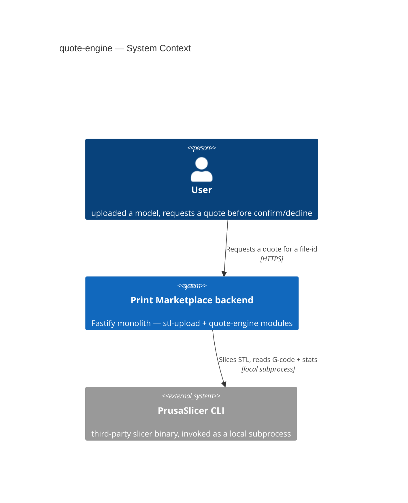
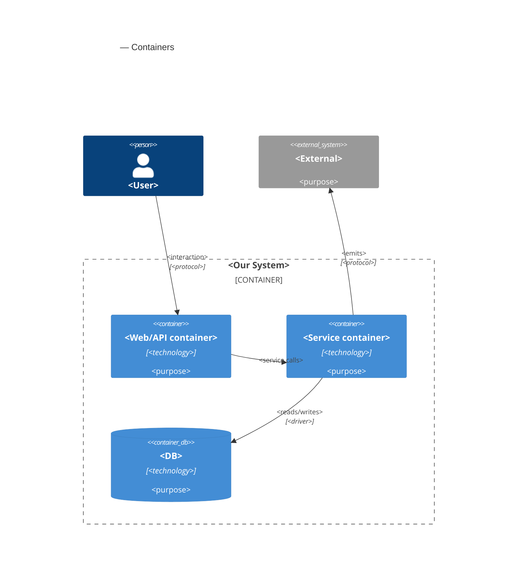
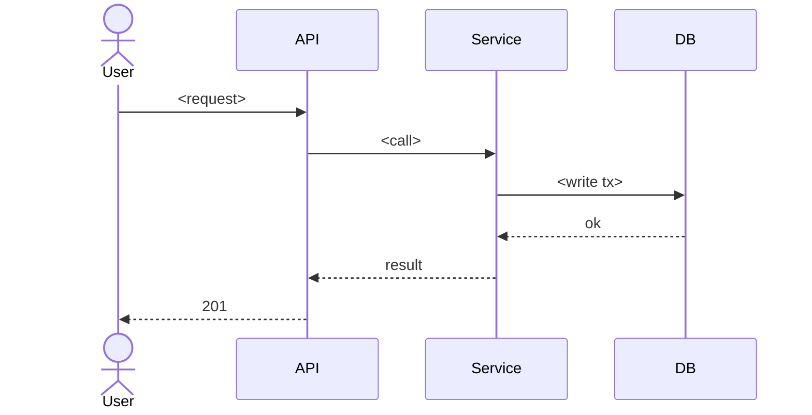

# Software Architecture Document — quote-engine

<!-- Stages 04-05 → see sdlc/plugin/skills/architecture-design/SKILL.md -->
<!-- 12 Arc42 sections. Empty sections — <!-- N/A: <one-line reason> -->. -->
<!-- C4 Context (L1) lives inline in §3. C4 Container (L2) lives inline in §5. -->
<!-- Заповнений приклад: див examples/course-lesson-mvp/sad.md у sdlc/ toolkit. -->

## 1. Introduction and goals

**Intent.** quote-engine turns a previously uploaded, validated STL model into an exact print quote by actually invoking PrusaSlicer CLI against one fixed printer+material configuration (Approach A, idea-brief §13) — real slice time and real material usage, not a weight-based estimate — then applies a configurable pricing formula to produce a price with a cost breakdown. It blocks clearly, instead of hanging or crashing, when a model can't be sliced, exceeds the fixed printer's build volume, or is no longer available in storage. It is the hard blocking dependency for order-confirmation, the next MVP flow step (PRD §1).

**Top-3 quality goals (1-liners; full scenarios in §10):**

1. Price accuracy — quoted price within ±5% of real print cost (PRD §6 NFR); a miss is a direct financial loss, not a UX defect.
2. Quote turnaround — p95 ≤ 60s end-to-end, including slicer wall-clock (PRD §6 NFR).
3. Graceful handling of bad input — unslicable, oversized, or missing models are blocked with a clear message, never a hang or crash (AC-02, AC-04, AC-05).

**Stakeholders.**

| Role | Interest | Sign-off owner? |
|---|---|---|
| user | gets an exact price/time to decide confirm or decline (US-01) | No |
| Product Owner (Yakiv Vakoliuk) | confirms the pricing formula and rates before launch (PRD §8 open question) | No |
| Tech Lead | SAD approval | Yes |
| Security Lead | reviews untrusted-STL-to-subprocess handling (PRD §6.1) | Yes |

## 2. Constraints

**Technical.**
- Node.js ≥20, TypeScript 6.0.3 (ESM, `"type": "module"`), Fastify 5.12.5.
- `@fastify/multipart`, `@fastify/static` already in use (stl-upload); no new HTTP-layer dependency expected.
- Filesystem-only persistence — no database, no accounts (CLAUDE.md, confirmed by Explore scan: no Prisma/Drizzle/SQL anywhere in repo).
- Layered convention: `routes/` → `services/` → `repositories/`, per ADR-0004 (stl-upload).
- New dependency: PrusaSlicer CLI, invoked as an untrusted-input subprocess (stl-parse-feature-plan.md). **No version pinned anywhere in the repo yet** — flagged as a risk in §11 (ties to stl-parse-feature-plan.md human checkpoint #1: wrapper not yet verified against real .stl files).

**Organisational.**
- Solo maintainer (Yakiv Vakoliuk), no on-call (inherited from stl-upload, PRD §6 Availability row).
- No hard external deadline — quote-engine is simply the only remaining blocker before further MVP progress (PRD §1; idea-brief §4).

**Conventions.**
- `CLAUDE.md` — project conventions.
- `{code, message}` error-sentinel shape, e.g. `upload.invalid_format` — quote-engine mints its own `quote.*` codes in the same shape.
- `SAFE_FILE_ID` path-safety regex pattern (`model-repository.ts`) — any file-id touching the filesystem must be validated this way.
- UUID v4 file-id (ADR-0005) — explicitly a cross-module contract; quote-engine reads this id, does not mint its own.

**Regulatory / external.**
- PRD §6.1: STL bytes are untrusted input to a subprocess — no shell interpolation of filenames/paths (same discipline as `SAFE_FILE_ID`).
- PRD §6.1: quote requests for an unrecognized or not-owned file-id get the same generic response as a malformed one (AC-06, enumeration resistance).

## 3. Context and scope

Quote-engine is a module inside the existing Print Marketplace Fastify monolith. A user who already uploaded a valid STL (stl-upload module) requests a quote for it; quote-engine slices that model via a local PrusaSlicer CLI subprocess and returns a price, print time, and material breakdown — or a clear blocking error if the model can't be sliced, exceeds the fixed printer's build volume, or no longer exists.

**External systems (in / out):**

| Actor or system | Type | Interaction |
|---|---|---|
| user | Person | Requests a quote for a previously uploaded model's file-id |
| PrusaSlicer CLI | System (external, local subprocess) | Receives STL + fixed printer/material profile, returns G-code + slicing stats via stdout, or a non-zero exit on unslicable/oversized geometry |

**C4 Context (L1):**



## 4. Solution strategy

**Top-3 strategic choices (the seeds for ADRs):**

1. **WebSocket push for the quote result** (ADR-0001) — the browser opens a WebSocket for a quote request and the server pushes `quote.done` / `quote.error` when the up-to-60s PrusaSlicer subprocess finishes, instead of holding an HTTP connection open or polling. Avoids the HTTP/proxy-timeout risk of a 60s blocking request while staying simpler than building a job-store + polling endpoint. Requires a new `@fastify/websocket` dependency and a new client-side pattern in `src/ui/`.

2. **Concurrency control for the shared PrusaSlicer subprocess** — deliberately left open (see §11 "Open architectural decision: concurrency model for PrusaSlicer invocations"). Candidates considered: an in-process FIFO queue with a single worker (zero new infra, matches the NFR's "≥1 concurrent, rest queue" literally) vs. a bounded worker pool (more throughput, more complexity the NFR doesn't currently require). Resolve before `sdlc:break-tasks` — this gates §7 Deployment's scaling-threshold wording.

3. **Persist the quote as a Firestore draft order, reusing order-confirmation's shared id** (ADR-0002) — quote-engine writes the computed price/time/breakdown into Firestore keyed by the same UUID v4 file-id that stl-upload minted and order-confirmation already expects to reuse (order-confirmation ADR-0003), so order-confirmation's later confirm step can act on an existing draft instead of re-deriving the quote. **This is a deliberate, explicit override of order-confirmation's own already-Accepted architecture** (ADR-0001 Firestore-for-orders-only, ADR-0002 in-process live recomputation, ADR-0004 exactly-once-via-`create()`, and data-model.md's "No persisted quote snapshot") — the product owner chose to proceed with Firestore-at-quote-time now and revisit order-confirmation's docs afterward, rather than follow the already-accepted "stateless, recompute live" design. Tracked as a High-severity risk in §11, not an open question, because the decision itself is made — the follow-up rework is the open item.

Each tactical decision in later sections should be traceable to one of these strategic seeds. Tactical decisions that *contradict* a strategic choice are red flags — surface them in §11 Risks.

**Decision overrides (¶4):** the Firestore-persistence choice above (strategic choice 3 / ADR-0002) knowingly contradicts order-confirmation's already-Accepted ADR-0001/0002/0004 and data-model.md. Recorded here per the critic-phase override convention so downstream skills (`sdlc:generate-data-model`, `sdlc:break-tasks`) see this was a deliberate choice, not a missed cross-feature read. See §11 for the required order-confirmation follow-up.

## 5. Building block view

<!-- 🎯 Навіщо: ВНУТРІШНЯ ДЕКОМПОЗИЦІЯ — модулі, контейнери, БД. Статична топологія:   -->
<!--           хто з ким може говорити. Без §5 §6 (сценарії) не має словника учасників. -->
<!-- 📋 Що писати: 1 абзац про стиль (шари/гексагональна/clean/на подіях) +            -->
<!--           дерево папок + Mermaid C4Container.                                       -->
<!-- 📌 Приклад: «web-app, content-api, media-worker, postgres, s3, cdn».                -->

<One paragraph: layered / hexagonal / clean / event-driven. Why.>

**Internal decomposition:**

```
<e.g. internal/modules/goals/>
├── domain/       <entities + sentinel errors>
├── app/          <use cases / services>
├── infra/        <repository + outbox impl>
├── ports/        <HTTP handlers, DTOs, error mapping>
└── module.go     <self-wiring>
```

**C4 Container (L2):**



## 6. Runtime view

<!-- 🎯 Навіщо: ПОТІК У RUNTIME для 1-2 критичних сценаріїв. Хто з ким коли і у якому     -->
<!--           порядку говорить. Без §6 §5 — лише купа коробок без життя.                  -->
<!-- 📋 Що писати: Mermaid sequenceDiagram. Учасники — імена з §5 (не вигадуй нові!).      -->
<!--           Повідомлення семантичні («складає чорновик»), БЕЗ HTTP-методів/шляхів —     -->
<!--           ендпоінт-рівневі sequence-діаграми зʼявляться у stage 06 (define-api).      -->
<!-- 📌 Приклад: «methodist → web-app: складає чорновик → web-app → content-api: зберегти». -->

**Critical flow 1: <flow name>**



<!-- For XS/S: 1 flow above is enough. For M+: add 2-4 more (e.g. failure-mode flow, async flow). -->

**Critical flow 2: <e.g. async event propagation>** — <if applicable, otherwise N/A>.

## 7. Deployment view

<!-- 🎯 Навіщо: ТОПОЛОГІЯ, яку DevOps має знати без читання Helm-чартів — скільки реплік,  -->
<!--           де живе фоновий обробник, ПРИ ЯКИХ ЧИСЛАХ масштабуємось.                     -->
<!-- 📋 Що писати: 2-3 речення про топологію + метрики + алерти + конкретні числа-пороги.   -->
<!-- 📌 Приклад: «500 IC → партиціонування за кварталом» (не «при зростанні подумаємо»).    -->
<!-- 🎯 Можна N/A для XS/S функцій, що переюзають існуюче розгортання без змін.            -->

<Topology in 2-3 sentences. Where it runs (k8s / VM / serverless), replicas, scaling thresholds.>

**Monitoring:**
- <Metrics — e.g. Prometheus `<metric_name>`>
- <Alerts — e.g. "outbox lag > 10 min → page on-call">
- <Tracing — e.g. OpenTelemetry HTTP spans>

**Scaling thresholds:**
- <e.g. 500 IC × 5 goals × 26 checkpoints/Q = 65k rows/year — comfortable in one table>
- <e.g. partitioning by quarter at >500k rows/year>

<!-- For XS/S that doesn't change deployment: <!-- N/A: feature reuses existing deployment unit -->. -->

## 8. Crosscutting concepts

<!-- 🎯 Навіщо: НАСКРІЗНІ ПАТЕРНИ, які перетинають кілька модулів: логування, помилки,    -->
<!--           авторизація, ID strategy, outbox, кеш. ⭐ Друга найгустіша секція.          -->
<!--           Якщо патерн всередині одного модуля — він НЕ сюди. Якщо це конвенція        -->
<!--           проєкту в цілому — у CLAUDE.md.                                              -->
<!-- 📋 Що писати: таблиця концепт / конвенція / де визначено. Один рядок на концепт.      -->
<!-- 📌 Приклад: «UUID v7 (час+випадковий, сортується) у app-layer» — як default з CLAUDE.md. -->

| Concept | Convention | Where defined |
|---|---|---|
| Logging | <e.g. structured slog, fields `module=<name>`> | <CLAUDE.md §X or here> |
| Authentication | <e.g. JWT via session middleware> | <CLAUDE.md §X> |
| Error handling | <e.g. domain sentinel → ports/errors.go → apperr JSON> | <CLAUDE.md §X> |
| ID strategy | <e.g. UUID v7 in app layer> | <CLAUDE.md §X> |
| Internationalisation | <e.g. N/A, English only> | — |
| Observability | <e.g. OpenTelemetry on HTTP boundaries> | — |
| Outbox / events | <module-specific patterns, if any> | <here> |

## 9. Architecture decisions

<!-- 🎯 Навіщо: ЗВОРОТНИЙ ІНДЕКС на папку adr/. `ls adr/` дає файли, §9 дає семантику —    -->
<!--           чому вони існують, до якого зрізу SAD привʼязані, у якому статусі.           -->
<!-- 📋 Що писати: таблиця з 4 колонками. Один рядок на ADR. Mixed status — це OK.         -->
<!-- 📌 Приклад: «0001 | Зберігати урок як таблицю блоків | Accepted | §4».                -->

| # | Title | Status | Section |
|---|---|---|---|
| <NNNN> | <imperative — e.g. "Use sliding window for rate limiting"> | Accepted | §<N> |
| <NNNN> | <imperative — e.g. "Co-locate outbox worker in API process"> | Accepted | §<N> |

ADR files live under `docs/features/<slug>/adr/NNNN-<title>.md`.

## 10. Quality requirements

<!-- 🎯 Навіщо: ДЕРЕВО ЯКОСТЕЙ (Quality Tree) — беремо мету з §1 і розкладаємо на          -->
<!--           конкретні листя: тести, метрики, конфіги, drill-и. ⭐ Без §10 §1 — це       -->
<!--           маніфест. З §10 кожна декларація мапиться на щось, ЩО МОЖНА ДОВЕСТИ.        -->
<!-- 📋 Що писати: на кожну якість з §1 — When / Then / How verify. Числа з PRD §6 NFR     -->
<!--           ДОСЛІВНО (не округлюй p95 ≤250мс до ≤300мс — це F6-помилка критика).        -->
<!-- 📌 Приклад: «p95 ≤500 мс на UPDATE блоку, перевіримо k6 load test 100 req/s».        -->

Each top-3 goal from §1 expanded into a full scenario:

**QG-1. <quality attribute>**
- **When:** <trigger condition>
- **Then:** <expected behavior with numbers from PRD NFR>
- **How verify:** <test / chaos drill / load test / observability>

**QG-2. <quality attribute>**
- **When:** <trigger>
- **Then:** <expected>
- **How verify:** <how>

**QG-3. <quality attribute>**
- **When:** <trigger>
- **Then:** <expected>
- **How verify:** <how>

## 11. Risks and technical debt

<!-- 🎯 Навіщо: ⭐ збирає ВСЕ, що може зламатись — і не лише технічне. Без §11 ризики   -->
<!--           обговорюються на стендапах і губляться; борг лишається у голові того,    -->
<!--           хто його прийняв.                                                          -->
<!-- 📋 Що писати: таблиця ризик/борг — серйозність — мітигація — власник. Технічний    -->
<!--           борг окремою секцією.                                                      -->
<!-- 📌 Приклад: «EM не пушить — member не оновлює дані | High | …». Перший ризик —      -->
<!--           часто продуктовий, не технічний. Це нормально.                            -->

<!-- Severity column literals: Low / Medium / High for regular risks; "Open question" for rows
     created by Step-7 `Save as Open Question` resolutions (see references/socratic-loop.md). -->

| Risk / debt | Severity | Mitigation | Owner |
|---|---|---|---|
| <e.g. Outbox lag may reach hours during downstream outage> | Medium | <Alert >10 min, on-call playbook, retry backoff> | <DevOps> |
| <e.g. No event schema versioning in v1> | Medium | <ADR-NNNN planned for v2, graceful handling of unknown fields> | <Backend> |
| Open architectural decision: <decision-headline> | Open question | Resolve before <stage trigger or YYYY-MM-DD>; <inline rationale from Step-7 Save-as-OQ> | <owner> |

**Accepted debt (acceptable in v1, plan to fix later):**
- <e.g. Goal entity is not versioned (immutable) — OK for v1, may need audit versioning in v2>

## 12. Glossary

<!-- 🎯 Навіщо: ⭐ СЛОВНИК ДОМЕНУ, який припиняє суперечки через рік («checkpoint —      -->
<!--           weekly чи biweekly? Quarter — календарний чи фіскальний?»).                -->
<!-- 📋 Що писати: таблиця термін / значення. Бізнес-терміни + технічні вперемішку.       -->
<!--           Один термін може мати дві мови у заголовку: «Goal (Обʼєктив)».              -->
<!-- 📌 Приклад: «Lesson | урок усередині курсу, що складається з блоків (text, video)». -->

| Term | Meaning |
|---|---|
| <e.g. Goal> | <quarterly intent in statement form> |
| <e.g. KR> | <Key Result — measurable target linked to a Goal> |
| <e.g. Checkpoint> | <bi-weekly progress update on a KR> |
