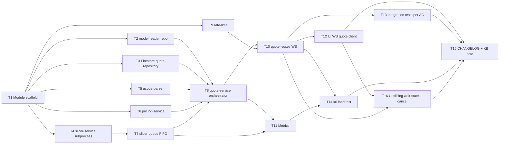

# Epic: quote-engine

**Owner:** Yakiv Vakoliuk (solo maintainer, no on-call — SAD §2)
**Created:** 2026-10-02

## Problem

`stl-upload` stores a validated STL but nothing turns it into a real price — the MVP flow (upload → quote → confirm/decline) is stuck at step 1, and order-confirmation (the next step) cannot be built without quote-engine's output (PRD §1).

## Solution

Approach A — Single-Config Slice-and-Price (idea-brief §13): every upload is sliced once against one fixed printer+material configuration via a real PrusaSlicer CLI subprocess; the slicer's real output feeds a configurable pricing formula. Three strategic choices anchor the design (sad.md §4):

1. WebSocket push for the quote result ([[../adr/0001-websocket-push-for-quote-result.md]]) — avoids a 60s-held HTTP connection.
2. In-process FIFO queue, single worker, for the shared PrusaSlicer subprocess ([[../adr/0003-in-process-fifo-queue-single-slicer-worker.md]]) — zero new infra, matches the NFR literally.
3. Persist the quote as a Firestore draft order ([[../adr/0002-persist-quote-as-firestore-draft-order.md]]) — deliberate override of order-confirmation's already-Accepted design; **tracked as a High-severity risk in sad.md §11, not resolved by this epic** (requires a separate `sdlc:architecture-design` pass for order-confirmation before either feature ships).

## Links

- PRD: [[../PRD.md]]
- SAD: [[../sad.md]]
- ADR-0001 (WebSocket push), ADR-0002 (Firestore draft order), ADR-0003 (FIFO queue)
- Pricing config: [[../pricing-config.json]]

## Scope note — UI tasks (T12, T16) are not formally architected in sad.md §5

sad.md §5's building-block view covers only `src/modules/quote-engine/` (backend). It does not list a UI container, yet ADR-0001's "Negative" consequences explicitly call for "a new client-side pattern" in `src/ui/`, and AC-01/AC-03/AC-04 are user-observable ("the user views the quote," "sees the price broken into its components"). T12 and T16 are derived from that ADR-0001 consequence + the ACs, not from an SAD building-block entry. **Flag for the architect:** sad.md §5/§8 should gain an explicit UI building block in a future revision; this gap is noted here per break-tasks protocol, not silently filled in.

## Scope addition 2026-10-02 — WS cancellation flow (T16 + amendments to T4, T7, T8, T10)

The user requested the frontend "Slicing..." wait-state + "Back to start" flow after the initial breakdown was drafted, with an explicit requirement that the backend hard-kill the in-flight PrusaSlicer subprocess when the WebSocket closes for any reason. This is a real capability the SAD/ADRs didn't specify (ADR-0001 only said "the client must handle a dropped connection as a quote failure" — it didn't mandate server-side cancellation). Per the user's confirmed choice (hard-kill, not let-it-finish-in-background), four already-drafted tasks were amended rather than left stale:

- **T4** (slicer-service) — gained `cancel()`/`AbortSignal` support (SIGTERM → SIGKILL fallback), AC-ss-6/7.
- **T7** (slicer-queue) — gained `cancel(jobId)` with two branches (dequeue if pending, delegate to T4 if running), AC-sq-5/6.
- **T8** (quote-service) — gained `cancelQuote(jobId)` plus a single-resolution race guard against "cancel lands the same tick the slice finishes," AC-qs-7/8.
- **T10** (quote-routes) — its previously-open AC-qr-5 ("decide and document the dropped-connection behavior") is now resolved concretely: the WS `close` handler always calls `cancelQuote`, AC-qr-5/6.

Each amended task file carries a `note:` frontmatter field pointing back to this entry for traceability.

## Scope amendment 2026-10-02 — verified PrusaSlicer behavior (T1, T4, T5, T8, T11, T13)

After installing PrusaSlicer 2.9.6 and testing the real CLI with a fixed PLA profile (`../slicer-profile-pla.ini`; helper `../slice-info.sh`), three assumptions in the original breakdown and SAD turned out to be wrong (full table in T4's "Verified CLI behavior"):

1. **Stats are not on stdout** — print time and filament grams are comments in the G-code file. → T4 returns the G-code path; T5 parses the file.
2. **An oversized model exits 0 and writes no G-code** (message: `All objects are outside of the print volume.`), so "non-zero exit" cannot detect AC-04. → T5 classifies it (message and/or `--info` size vs the profile's bed).
3. **A non-watertight model slices "successfully" with exit 0 and silently wrong stats** (0.26 g vs 0.69 g in the test). Only `--info` (`manifold = no`) reveals it. → T4 runs `--info` before slicing; T5 returns `non_manifold`; T8 maps it to `quote.unslicable`. **Product decision (2026-10-02): reject non-watertight models rather than quote the auto-repaired mesh.**

Amendments: **T1** also scaffolds `config/slicer-profile-pla.ini`; **T4** new return contract, `--info` pre-step, per-job temp dir + `cleanup()`, AC-ss-2 narrowed and AC-ss-8/9 added; **T5** retitled, four result kinds, AC-gp-1..4; **T8** failure mapping + `cleanup()` in `finally`; **T11** and **T13** edge-case/fixture notes. Still unverified (carried in T4): SIGTERM/temp-file behavior on cancel, and headless operation on Linux/Docker/CI. `sad.md` §3/§5/§6 corrected to match.

## Waves

| Wave | Tasks | Parallel | Goal |
|---|---|---|---|
| 1 | T1 | — | Module scaffold |
| 2 | T2, T3, T4, T5, T6, T9 | yes | Independent layer primitives (repo, Firestore, slicer wrapper, parser, pricing, rate-limit) |
| 3 | T7, T8 | mostly sequential (T7→T8) | Queue + orchestration service |
| 4 | T10, T11 | T10 then T11 | WS route (new dependency) + metrics |
| 5 | T12, T13, T14, T15, T16 | T12 parallel with T13/T14; T16 after T12; T15 last | UI, integration tests, load test, docs |

## Dependency graph

## Tasks

- [x] [[T1-module-scaffold|T1: quote-engine module scaffold]] — XS — Must
- [ ] [[T2-model-reader-repository|T2: model-reader repository (SAFE_FILE_ID read)]] — S — Must
- [ ] [[T3-firestore-quote-repository|T3: Firestore quote-repository + credential loading]] — S — Must
- [ ] [[T4-slicer-service-subprocess|T4: slicer-service PrusaSlicer CLI wrapper]] — S — Must
- [ ] [[T5-gcode-parser|T5: gcode-parser (stdout → time/filament stats)]] — S — Must
- [ ] [[T6-pricing-service|T6: pricing-service (formula + breakdown)]] — XS — Must
- [ ] [[T7-slicer-queue|T7: slicer-queue in-process FIFO, single worker]] — S — Must
- [ ] [[T8-quote-service-orchestrator|T8: quote-service orchestrator]] — M — Must
- [ ] [[T9-rate-limit|T9: quote-engine rate-limit (reuse stl-upload pattern)]] — XS — Must
- [ ] [[T10-quote-routes-websocket|T10: quote-routes WebSocket handshake + push]] — M — Must
- [ ] [[T11-metrics|T11: Prometheus metrics (slice duration, queue depth, exit code)]] — S — Must
- [ ] [[T12-ui-websocket-quote-client|T12: UI — WebSocket quote client + breakdown display]] — M — Must
- [ ] [[T13-integration-tests-per-ac|T13: Integration tests per AC (fixture STLs)]] — M — Must
- [ ] [[T14-k6-load-test|T14: k6 load test — p95 ≤60s, queue-depth alert threshold]] — S — Must
- [ ] [[T15-changelog-kb-note|T15: CHANGELOG + KB note]] — XS — Must
- [ ] [[T16-ui-slicing-wait-state-and-cancel|T16: UI — "Slicing..." wait state + "Back to start" cancel]] — S — Must

**Total:** 0/16 done; ~10 person-days (XS=2h, S=~0.5d, M=~1d); ~2 calendar weeks solo.

## Risks (inherited from sad.md §11 — not re-litigated here)

| Risk | Severity | Note |
|---|---|---|
| order-confirmation's Accepted architecture is now stale (ADR-0002 override) | High | Out of scope for this epic — separate `sdlc:architecture-design` pass required before either feature ships, owner Yakiv Vakoliuk. |
| PrusaSlicer wrapper unverified against real .stl files (stl-parse-feature-plan.md checkpoint #1) | Medium | T4's DoD requires running against ≥1 real .stl fixture before merge — this is the checkpoint, tracked at task level. |
