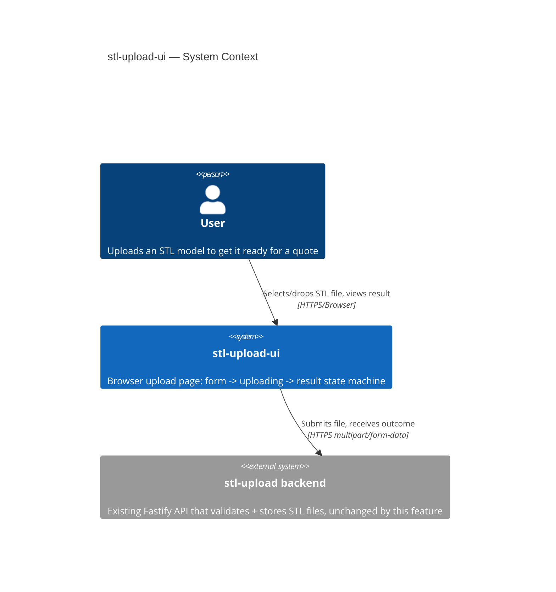
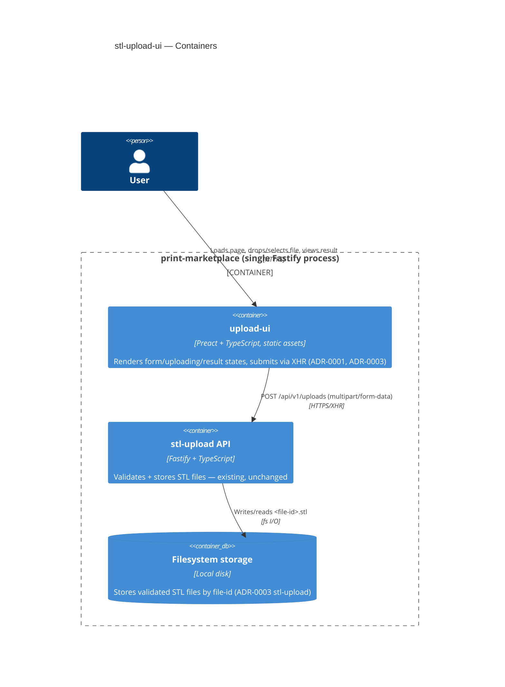
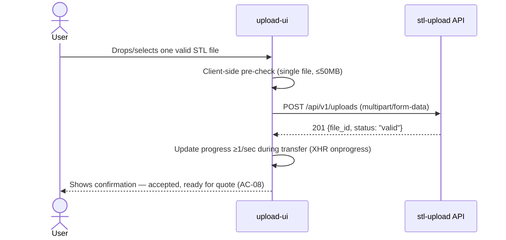
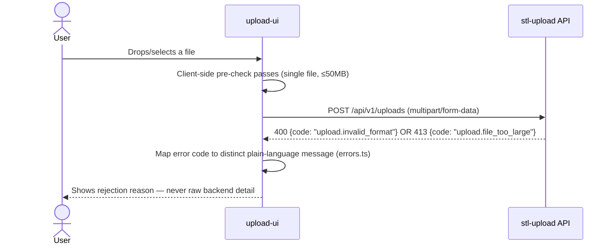
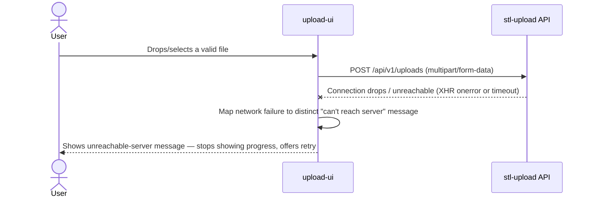

# Software Architecture Document — stl-upload-ui

<!-- feature_size: S assumed (not run through sdlc:classify-size — user chose to skip and let this skill infer it, PRD §8). Rationale: single-page frontend feature, no new backend/API, no migration, no breaking changes, but multiple states/error paths + security-sensitive rendering (AC-06). -->
<!-- Brownfield scan performed by Explore subagent 2026-09-30: repo has a Fastify/TS backend (stl-upload module), NO existing frontend/UI code anywhere. This is the first UI code in the repo. -->
<!-- CLAUDE.md at repo root is stale (still says "no application code exists yet") — flagged, not corrected here (out of scope for this skill). -->

<!-- Stages 04-05 → see sdlc/plugin/skills/architecture-design/SKILL.md -->
<!-- 12 Arc42 sections. Empty sections — <!-- N/A: <one-line reason> -->. -->
<!-- C4 Context (L1) lives inline in §3. C4 Container (L2) lives inline in §5. -->
<!-- Заповнений приклад: див examples/course-lesson-mvp/sad.md у sdlc/ toolkit. -->

## 1. Introduction and goals

**Intent.** Give non-technical users (the stakeholder/investor watching the upcoming demo, plus early testers) a browser-based front door to the already-shipped `stl-upload` backend — today the only way to invoke it is curl/Postman. The page is a state machine (form → uploading → result) with plain-language, per-error-code messaging; quote/order-confirmation states are out of scope until their backends exist.

**Top-3 quality goals (1-liners; full scenarios in §10):**

1. Fast, honest feedback — time-to-first-visible-feedback ≤2000ms, progress ≥1 update/sec (demo-critical; this is the funnel's entry point).
2. Correct error-state mapping — every backend failure (format/size/rate-limit/network) maps to a distinct, plain-language message, never raw backend detail.
3. Safe rendering of untrusted input — filenames render strictly as plain text, never markup (AC-06, hard requirement, not optional hardening).

**Stakeholders.**

| Role | Interest | Sign-off owner? |
|---|---|---|
| User | Uploads an STL, needs a synchronous yes/no without dev help | No |
| Tech Lead | SAD approval; fit with existing Fastify/TS backend conventions | Yes |
| Security Lead | Reviews XSS/filename-rendering hardening (AC-06) + abuse cases | No |
| Yakiv Vakoliuk (PM/owner) | Demo readiness — 100% of upload step demoable by demo date | No |

## 2. Constraints

**Technical.**
- Node.js ≥20, TypeScript ^6.0.3 (target ES2022, module/moduleResolution NodeNext, strict + noUncheckedIndexedAccess)
- Backend: Fastify ^5.12.5 + @fastify/multipart ^10.1.2 (existing `stl-upload` module, unchanged by this feature)
- No frontend framework/bundler exists anywhere in the repo — this feature is the first UI code. Frontend tooling choice is decided in §4 (PRD §8 explicitly defers it to architecture-design).
- Architecture convention: sibling `stl-upload` module follows a simple layered style (routes/ → services/ → repositories/, ADR-0004) — applies to backend modules; not assumed to apply verbatim to a client-side page.

**Organisational.**
- No committed deadline — PRD §8 flags "exact demo date: none set yet" as still open (tracked as a risk in §11).
- Effort budget and team composition not quoted in PRD.

**Conventions.**
- Root `CLAUDE.md` documents build/lint/test conventions (`npm run build`=tsc, `lint`=eslint, `test`=vitest) but is stale on project state (still says "no code exists yet, only planning docs") — flagged, correction out of scope for this skill.

**Regulatory / external.**
- Data classification: internal (PRD §6.1) — filenames/bytes pass through, no new data at rest in the UI itself.
- No PII, no new authn/authz surface (MVP-wide no-auth exclusion).
- Abuse cases carried from PRD §6.1: filename-rendering XSS (AC-06), multi-file/folder bypass (AC-05), raw backend error leakage, rate-limit surfacing.

## 3. Context and scope

The `stl-upload-ui` page is the only browser-facing entry point to the marketplace's upload step. It lets a user pick or drop a single STL file and shows a synchronous result (accepted, or a plain-language rejection reason) by calling the existing `stl-upload` backend's single endpoint. It has no server-side component of its own beyond static hosting/serving — no new backend logic, no data store.

**External systems (in / out):**

| Actor or system | Type | Interaction |
|---|---|---|
| User | Person | Selects/drops one STL file, views the result |
| `stl-upload` backend (`POST /api/v1/uploads`) | System (internal, existing) | Receives multipart upload, returns `{file_id, status}` or a `{code, message}` error |

**C4 Context (L1):**



## 4. Solution strategy

**Top-3 strategic choices (the seeds for ADRs):**

1. **Preact as the UI library (no full React, no zero-dependency vanilla)** — Middle ground between the repo's "boring technology" bias (CLAUDE.md) and PRD §2 Goal 3's requirement that the state machine extend to quote/order-confirmation screens later without a rewrite. See ADR-0001.
2. **Fastify serves the UI's static assets (same-origin, single deployable)** — Avoids introducing CORS handling and new hosting infrastructure for a size-S, demo-driven feature; extends the co-located-deployment convention already established by ADR-0003 (stl-upload). See ADR-0002.
3. **XMLHttpRequest (not `fetch()`) for the upload request** — The only option with standardized, broadly-supported byte-level upload progress events, required to satisfy PRD NFR §6 (≥1 progress update/sec) without violating the non-goal against fabricated/cosmetic progress. See ADR-0003.

Each tactical decision in later sections should be traceable to one of these strategic seeds. Tactical decisions that *contradict* a strategic choice are red flags — surface them in §11 Risks.

## 5. Building block view

A single client-side "module" that owns no business logic of its own — only rendering and the upload call. One top-level Preact component owns the state machine (`idle → uploading → success | error`) and renders one of three child components per state. A dedicated `upload-client.ts` wraps the XHR call (ADR-0003) and a dedicated `errors.ts` maps every backend `{code, message}` plus network/timeout failures to the plain-language text required by AC-02/03/04. It lives in a new top-level `src/ui/` directory, parallel to (not inside) `src/modules/`, because the existing routes/services/repositories convention (ADR-0004, stl-upload) is for backend business-logic modules — forcing UI code into that shape would create empty `services/`/`repositories/` folders with no real content. On the backend side, `app.ts` gains one small addition: registering `@fastify/static` to serve the built UI (ADR-0002) — plumbing, not a new business module.

**Internal decomposition:**

```
src/ui/
├── main.tsx              <entry point, mounts App>
├── app.tsx                <top-level Preact component: owns state-machine state>
├── components/
│   ├── UploadForm.tsx      <drag-drop + click-to-browse (AC-01b), single-file guard (AC-05)>
│   ├── UploadProgress.tsx  <renders real byte-progress from upload-client.ts, ≥1 update/sec>
│   └── UploadResult.tsx    <success/error display; filenames rendered as plain text only (AC-06)>
├── upload-client.ts       <XHR wrapper — submit + progress + response/error mapping>
└── errors.ts              <maps backend {code,message} + network/timeout → plain-language text>

src/app.ts                 <existing Fastify app builder — gains @fastify/static registration for dist-ui/>
```

**C4 Container (L2):**



## 6. Runtime view

**Critical flow 1: Happy path — valid STL accepted (AC-01)**



**Critical flow 2: Backend rejects the file — invalid format or too large (AC-02, AC-03)**



**Critical flow 3: Connection lost mid-upload (AC-04)**



## 7. Deployment view

<!-- N/A: feature reuses existing deployment unit (ADR-0002) — no new infra, no new replicas/scaling thresholds. -->

The feature reuses the existing single Fastify process/deployment unit (ADR-0002) — no new deployment surface, no new replicas, no new scaling thresholds. PRD §6 NFR measurement sources (client-side upload timer, client-side progress-event instrumentation) are satisfied entirely in-browser (e.g. `performance.now()` timestamps) — no new server-side telemetry endpoint is added for this feature, since these NFRs describe what the user experiences, not server load.

## 8. Crosscutting concepts

| Concept | Convention | Where defined |
|---|---|---|
| Logging | N/A — feature adds no server-side logic; browser console only, dev-time | — |
| Error handling / mapping | Central module maps backend `{code,message}` + network/timeout → plain-language text; never surfaces raw backend detail | `src/ui/errors.ts` (§5) |
| Output encoding (XSS) | Filenames render via Preact's default text-node escaping (JSX text interpolation) — never `dangerouslySetInnerHTML` or raw DOM string insertion | `src/ui/components/UploadResult.tsx` (AC-06, hard requirement per PRD §6.1) |
| ID strategy | N/A — no new IDs generated client-side; `file_id` is returned by backend (UUID v4, ADR-0005 stl-upload) | — |
| Internationalisation | N/A, English only (matches stl-upload backend scope) | — |
| Observability | Client-side only: `performance.now()` timestamps for NFR verification (§7); no new server telemetry | — |

## 9. Architecture decisions

<!-- 🎯 Навіщо: ЗВОРОТНИЙ ІНДЕКС на папку adr/. `ls adr/` дає файли, §9 дає семантику —    -->
<!--           чому вони існують, до якого зрізу SAD привʼязані, у якому статусі.           -->
<!-- 📋 Що писати: таблиця з 4 колонками. Один рядок на ADR. Mixed status — це OK.         -->
<!-- 📌 Приклад: «0001 | Зберігати урок як таблицю блоків | Accepted | §4».                -->

| # | Title | Status | Section |
|---|---|---|---|
| 0001 | Use Preact for upload-ui | Accepted | §4 |
| 0002 | Serve upload-ui static assets from Fastify | Accepted | §4 |
| 0003 | Use XMLHttpRequest for upload progress | Accepted | §4 |

ADR files live under `docs/features/<slug>/adr/NNNN-<title>.md`.

## 10. Quality requirements

Each top-3 goal from §1 expanded into a full scenario:

**QG-1. Fast, honest feedback**
- **When:** A user drops/selects a file and submits the upload.
- **Then:** Time-to-first-visible-feedback ≤ 2000 ms after file drop/select; progress feedback updates ≥ 1 update/sec during upload; p95 latency submit→result shown ≤ 10500 ms (PRD §6 NFR, verbatim).
- **How verify:** Client-side `performance.now()` timestamps captured at file-select, first render, and each progress event; verified manually in a pre-demo checklist. No automated browser-perf test exists in this pass (no Playwright/similar tool in the repo today) — tracked as accepted debt in §11.

**QG-2. Correct error-state mapping**
- **When:** The backend returns `400 upload.invalid_format`, `413 upload.file_too_large`, `429 upload.rate_limited`, a 5xx, or the XHR reports a network failure/timeout.
- **Then:** The user sees exactly one of four distinct plain-language messages (AC-02/03/04) — never raw backend error detail or a stack trace.
- **How verify:** Unit tests on `src/ui/errors.ts` (vitest, matching repo convention) covering all documented backend codes plus the network/timeout case.

**QG-3. Safe rendering of untrusted input**
- **When:** A filename containing markup (e.g. `<script>...</script>`) is displayed on the result screen.
- **Then:** It renders strictly as plain text — never executes, never interpreted as markup (AC-06).
- **How verify:** Component test (vitest) asserting `UploadResult` renders a crafted filename as inert text content, with no `dangerouslySetInnerHTML` or raw DOM string insertion anywhere in the render path.

## 11. Risks and technical debt

| Risk / debt | Severity | Mitigation | Owner |
|---|---|---|---|
| No demo date committed yet (PRD §8) — NFR/deployment decisions in this SAD assume a near-term demo but the date isn't fixed | Medium | Set the exact date; re-confirm NFR targets still hold once it's known | Yakiv Vakoliuk |
| Root `CLAUDE.md` is stale — still says "no application code exists yet, only planning docs," despite a full Fastify/TS backend and now this UI landing | Low | Update `CLAUDE.md` once `stl-upload-ui` code merges, to reflect real build/lint/test commands and architecture | Whoever implements stl-upload-ui |

**Accepted debt (acceptable in v1, plan to fix later):**
- No automated browser-perf test verifies QG-1 (time-to-first-feedback, progress rate, p95 latency) — verified manually via `performance.now()` timestamps in a pre-demo checklist instead. Adding a browser-test tool (e.g. Playwright) for one NFR would be a new dependency beyond this feature's scope.
- ADR-0002 couples the UI's and API's release cycles (same Fastify process/deployment unit) — a UI-only change still requires redeploying the whole service. Acceptable for a size-S, single-consumer feature; revisit if the UI grows independent release cadence needs.

## 12. Glossary

<!-- No CONTEXT.md exists in this repo — terms below are extracted from PRD + this SAD body; flagged for sdlc:fix-term follow-up. -->

| Term | Meaning |
|---|---|
| STL | The 3D-model file format a user uploads; the marketplace funnel's entry point |
| `file_id` | UUID v4 identifier returned by the backend on a successful upload; sole access-control mechanism in v1 — no accounts (ADR-0005, stl-upload) |
| Upload state machine | The `idle → uploading → success \| error` state that determines which of `UploadForm` / `UploadProgress` / `UploadResult` renders (§5) |
| Plain-language error mapping | The rule (AC-02/03/04, §5 `errors.ts`) that every backend or network failure surfaces as one of a fixed set of user-readable messages, never raw backend detail |
