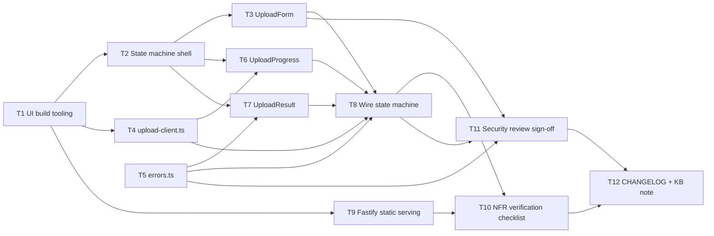

# Task breakdown — stl-upload-ui

<!-- Stage 13 → see sdlc/plugin/skills/break-tasks/SKILL.md -->

## Upstream artefacts

- [PRD](../PRD.md) — AC-01, AC-01b, AC-02, AC-03, AC-04, AC-05, AC-06, AC-07, AC-08, §6 NFR, §6.1 Security/privacy
- [SAD](../sad.md) — §4 Solution strategy, §5 Building block view, §6 Runtime view, §7 Deployment, §8 Crosscutting, §9 ADR index, §10 Quality requirements, §11 Risks
- ADRs: [0001](../adr/0001-use-preact-for-upload-ui.md) Preact for upload-ui (Accepted) · [0002](../adr/0002-serve-upload-ui-static-assets-from-fastify.md) serve UI from Fastify (Accepted) · [0003](../adr/0003-use-xhr-for-upload-progress.md) XHR for upload progress (Accepted)
- Reference: [stl-upload openapi.yaml](../../stl-upload/contracts/openapi.yaml) — single consumed endpoint `POST /api/v1/uploads`, error codes `upload.invalid_format` / `upload.file_too_large` / `upload.rate_limited`

## Scope note

This is a single-page, no-backend-change feature (SAD §5) decomposed by the building-block layers in SAD §5 (`app.tsx` state machine, `UploadForm`/`UploadProgress`/`UploadResult` components, `upload-client.ts`, `errors.ts`) plus the one backend-side addition (`@fastify/static` registration, ADR-0002) and the NFR/security verification work called for in PRD §6/§6.1 and SAD §10.

**Assumption surfaced during breakdown (not specified in SAD/ADR-0001):** ADR-0001's "Negative" consequence notes Preact "needs a bundler/transform step" but does not name one. T1 below picks **esbuild** (zero-config, widely used, no new framework commitment beyond what ADR-0001 already accepts) as the smallest tool that satisfies the JSX/bundling requirement. This is an implementation detail within ADR-0001's scope, not a new architectural decision — flag to Tech Lead if a different bundler is preferred before T1 starts.

Out of scope for this breakdown (per PRD §3 non-goals): quote/order-confirmation screens, 3D model preview, login/auth, animated/cosmetic progress polish. Do not create implementation tasks for these until they land in a future PRD/SAD.

## Dependency graph

## Tasks

| ID  | Title                                             | DoR                     | DoD                                                                                                                             | Deps               | Estimate | Owner          |
| --- | -------------------------------------------------- | ------------------------ | -------------------------------------------------------------------------------------------------------------------------------- | ------------------- | -------- | -------------- |
| T1  | [UI build tooling scaffold](t1-ui-build-tooling.md) | SAD §5, ADR-0001 Accepted | `npm run build:ui` emits `dist-ui/` from `src/ui/**`; `tsc --noEmit` + lint pass on `.tsx`                                      | —                    | S        | Yakiv Vakoliuk |
| T2  | [State machine shell](t2-state-machine-shell.md)    | T1 merged                | `app.tsx` owns `idle → uploading → success \| error` state; component test asserts correct child renders per state             | T1                   | S        | Yakiv Vakoliuk |
| T3  | [UploadForm component](t3-upload-form.md)           | T2 merged                | Drag-drop + click-to-browse (AC-01b); rejects multi-file/folder drop client-side before any network call (AC-05)               | T2                   | S        | Yakiv Vakoliuk |
| T4  | [upload-client.ts](t4-upload-client.md)             | T1 merged                | Promise wrapper over XHR (ADR-0003): resolves on 2xx, rejects with typed error on 4xx/5xx/network/timeout; emits progress events | T1                   | S        | Yakiv Vakoliuk |
| T5  | [errors.ts](t5-errors-mapping.md)                   | PRD AC-02/03/04 Accepted | Unit tests cover all 3 documented backend codes + 5xx + network/timeout → 5 distinct plain-language messages, never raw detail  | —                    | XS       | Yakiv Vakoliuk |
| T6  | [UploadProgress component](t6-upload-progress.md)   | T2, T4 merged            | Renders real byte progress from `upload-client.ts` events; component test asserts ≥1 render per synthetic progress event stream | T2, T4               | XS       | Yakiv Vakoliuk |
| T7  | [UploadResult component](t7-upload-result.md)       | T2, T5 merged            | Renders success/error outcome; filename rendered as inert text only (AC-06) — test asserts a crafted `<script>` filename never executes | T2, T5               | S        | Yakiv Vakoliuk |
| T8  | [Wire state machine end-to-end](t8-wire-state-machine.md) | T3, T4, T5, T6, T7 merged | `app.tsx` wires form → upload-client → progress/errors → result; integration test covers AC-01, AC-02, AC-03, AC-04 happy/error paths | T3, T4, T5, T6, T7   | M        | Yakiv Vakoliuk |
| T9  | [Fastify static serving](t9-fastify-static.md)      | T1 merged                | `@fastify/static` registered in `app.ts` serving `dist-ui/` (ADR-0002); test asserts `GET /` returns 200 with the built page    | T1                   | S        | Yakiv Vakoliuk |
| T10 | [NFR verification checklist](t10-nfr-verification.md) | T8, T9 merged           | Pre-demo checklist doc + one manual dry run recording `performance.now()` timestamps against SAD §10 QG-1 targets               | T8, T9               | XS       | Yakiv Vakoliuk |
| T11 | [Security review sign-off](t11-security-review.md)  | T3, T5, T8 merged        | Security Lead confirms AC-06 filename rendering, AC-05 client-side guard, and no raw-error leakage; sign-off recorded            | T3, T5, T8           | S        | Security Lead  |
| T12 | [CHANGELOG + KB note](t12-changelog-kb-note.md)     | T10, T11 done            | CHANGELOG entry; KB note on extending the state machine (PRD Goal 3); root `CLAUDE.md` updated to reflect real UI build/lint/test commands (SAD §11 risk) | T10, T11             | XS       | Yakiv Vakoliuk |

## Estimation legend

- XS: ≤2h
- S: ≤1d
- M: 1-2d (borderline — consider splitting)
- L: must be split, ≤1d did not work out
