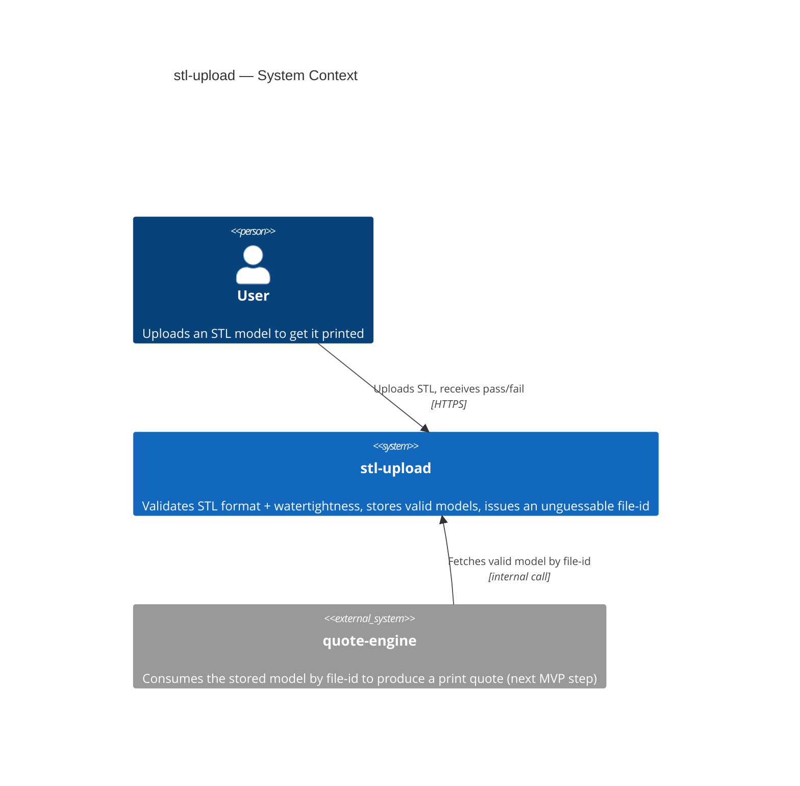
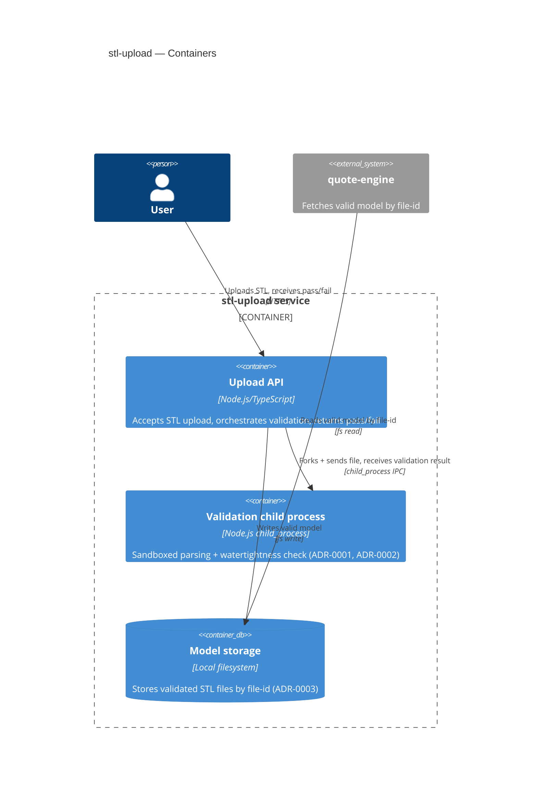
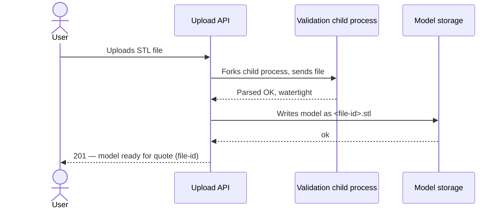
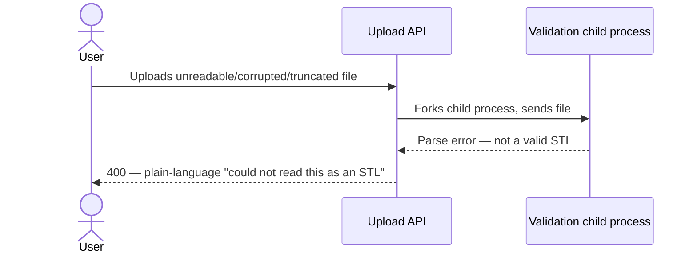
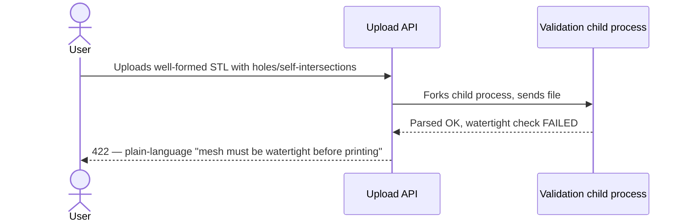
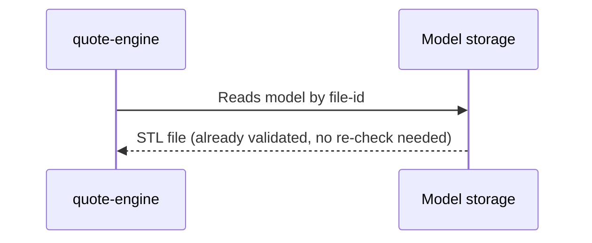

# Software Architecture Document — stl-upload

<!-- Stages 04-05 → see sdlc/plugin/skills/architecture-design/SKILL.md -->
<!-- 12 Arc42 sections. Empty sections — <!-- N/A: <one-line reason> -->. -->
<!-- C4 Context (L1) lives inline in §3. C4 Container (L2) lives inline in §5. -->

## 1. Introduction and goals

**Intent.** stl-upload — це точка входу всього MVP-флоу маркетплейсу 3D-друку (upload → quote → confirm/decline). Користувач без досвіду в 3D-моделюванні завантажує STL-файл; система синхронно перевіряє, що файл читається і має watertight-геометрію (без дірок/самоперетинів), і або зберігає модель з унікальним ідентифікатором, готовим для quote-engine, або одразу пояснює зрозумілою мовою, чому файл відхилено (PRD §2 Goals, §1 Context).

**Top-3 quality goals (1-liners; full scenarios in §10):**

1. Точність валідації watertightness — валідатор має погоджуватись зі справжнім слайсером у ≥99% випадків (PRD §6 Accuracy), інакше ламається довіра до негайного pass/fail.
2. Безпека обробки недовірених бінарних файлів — sandboxed-парсинг, головний ризик idea-brief §10 і PRD §6.1 abuse case #1.
3. Продуктивність синхронної перевірки — p95 ≤10000 ms (PRD §6 Latency), щоб "негайна відповідь" залишалась негайною.

**Stakeholders.**

| Role | Interest | Sign-off owner? |
|---|---|---|
| User (uploader) | Отримує негайний yes/no без async-стану; довіряє, що модель приватна (US-01…US-05) | No |
| Tech Lead | Затверджує SAD перед stage 06 | Yes |
| Security Lead | Затверджує untrusted-parsing boundary (PRD §6.1 — security review Required) | Yes |

## 2. Constraints

**Technical.**
- Node.js + TypeScript — the only stack decision locked so far (`docs/overview.md`).
- No framework, datastore, or hosting choice made yet — open strategic decisions, resolved in §4/§5, not pre-existing constraints.

**Organisational.**
- Deadline: 2 тижні (hard, idea-brief §13 two-week solo-delivery constraint for Approach A).
- Team: solo maintainer, no on-call (PRD §6 Availability rationale).

**Conventions.**
- `CLAUDE.md` currently has no code conventions (repo is pre-code) — no pre-existing naming/error-handling pattern to inherit.

**Regulatory / external.**
- None new — PRD §6.1 classifies uploaded files as internal data, no new PII collected.
- Security review is procedurally required before ship (PRD §6.1) — process gate, not a regulatory constraint.

## 3. Context and scope

<!-- brownfield: N/A — greenfield repo -->

Користувач без облікового запису завантажує STL-файл через веб. `stl-upload` синхронно перевіряє формат і watertightness, зберігає валідну модель з unguessable file-id (AC-04) і віддає цей file-id вниз по флоу для `quote-engine` — наступного кроку MVP-флоу (PRD §1, AC-05). Немає third-party інтеграцій: весь untrusted-parsing відбувається локально в sandboxed процесі (PRD §6.1), без зовнішніх сервісів чи API.

**External systems (in / out):**

| Actor or system | Type | Interaction |
|---|---|---|
| User | Person | Завантажує STL, отримує негайний pass/fail (US-01…US-04) |
| quote-engine | System (internal, окрема фіча MVP) | Запитує валідну модель за file-id, без повторної валідації (AC-05) |

**C4 Context (L1):**



## 4. Solution strategy

**Inherited from idea-brief §13 (Approach A, locked — not re-litigated here):** synchronous, single-pass, local validate-then-store pipeline; no auto-repair; no queue/async processing.

**Top-3 strategic choices (the seeds for ADRs):**

1. **Готова npm-бібліотека для геометричної валідації (не власний алгоритм, не shared PrusaSlicer CLI)** — обираємо існуючу open-source бібліотеку для парсингу STL і перевірки watertightness замість написання власного edge-pairing алгоритму або перевикористання PrusaSlicer CLI з quote-engine. Тримає stl-upload незалежним модулем від quote-engine (§1 QG-1 точність, §2 деталь: два-тижневий дедлайн не дозволяє писати й верифікувати власну геометричну математику). → ADR-0001.
2. **child_process з лімітами для sandboxed-парсингу** — недовірений парсинг (npm-бібліотека виконує нативний код на байтах користувача) запускається в окремому Node-процесі через `child_process.fork`, з timeout і memory cap, без мережі. Задовольняє §1 QG-2 безпеку і PRD §6.1 abuse case #1. → ADR-0002.
3. **Локальна файлова система для зберігання валідних моделей (v1)** — валідні STL зберігаються на диску сервера за `<file-id>.stl`; горизонтальне масштабування відкладене (accepted debt у §11). Узгоджено з §2 двотижневим дедлайном і §7 single-instance топологією v1. → ADR-0003.

Each tactical decision in later sections should be traceable to one of these strategic seeds.

## 5. Building block view

Простий шаровий стиль (routes/services/repositories) — перша фіча в грінфілд-репозиторії, вибрано замість гексагонального через 2-тижневий solo-дедлайн (§2): менше файлів/інтерфейсів на старті. → ADR-0004. Фізична межа — один Node/TS-сервіс: недовірений парсинг виконується як forked child process (ADR-0002) *всередині* цього ж сервісу, не окремим воркер-деплойментом (узгоджено з §4 sync/no-queue стратегією).

**Internal decomposition:**

```
src/modules/stl-upload/
├── routes/       <HTTP handler: POST /uploads, DTO + response mapping>
├── services/      <upload-and-validate use case; форкає child process (ADR-0002),
│                   викликає npm-бібліотеку валідації (ADR-0001) всередині child>
├── repositories/  <read/write validated STL to local filesystem (ADR-0003)>
└── module.ts      <self-wiring>
```

**C4 Container (L2):**



## 6. Runtime view

**Critical flow 1: Happy path — valid STL upload (US-01, AC-01)**



**Critical flow 2: Invalid format (US-02, AC-02)**



**Critical flow 3: Non-watertight geometry (US-03, AC-03)**



**Critical flow 4: quote-engine fetches a valid model (US-05, AC-05)**



<!-- Sandbox timeout/crash — dropped as a standalone diagram; documented as a §8 crosscutting concern (timeout + resource-limit handling) instead of a fifth sequence diagram. -->

## 7. Deployment view

stl-upload запускається як один довгоживучий Node/TS-процес (systemd/pm2) на одній VM з локальним диском — узгоджено з ADR-0003 (файли на диску, недоступні між інстансами) і §2 двотижневим дедлайном (без оркестрації контейнерів). Не окрема ADR-гідна тема — це прямий наслідок уже прийнятого ADR-0003, не окреме рішення з альтернативами.

**Monitoring:**
- Метрика latency: тривалість upload-validate запиту (PRD §6 latency p95 ≤10000 ms).
- Alert: сплеск 5xx/timeout на sandbox child process (ADR-0002) — сигнал, що ліміти ресурсів занизькі або є атака.
- Tracing: базовий request-id у логах (structured logging — узгодиться в §8).

**Scaling thresholds:**
- NFR throughput ≥5 req/s на інстанс (PRD §6) — досяжно в межах одного інстансу для MVP-навантаження.
- Горизонтальне масштабування (кілька інстансів) вимагає спершу міграції з ADR-0003 (локальний диск → object storage) — задокументовано як accepted debt у §11.

<!-- N/A not applicable: this is the feature's first deployment unit, not a reuse of an existing one -->


## 8. Crosscutting concepts

<!-- Greenfield: CLAUDE.md has no pre-existing conventions to inherit — these are fresh decisions, not overrides. -->

| Concept | Convention | Where defined |
|---|---|---|
| Logging | Structured JSON logs, fields include `request_id`; no PII/file-content logged | here |
| Authentication | N/A — MVP has no accounts (PRD §3 Non-goals) | PRD §3 |
| Error handling | HTTP 400 (invalid format, AC-02) / 422 (non-watertight, AC-03), plain-language message, no mesh-repair jargon (PRD §2) | here |
| ID strategy | UUID v4 for file-id — unguessable, sole access control (ADR-0005) | ADR-0005 |
| Internationalisation | N/A, English only | — |
| Observability | Latency + sandbox-crash/timeout metrics (§7 Monitoring) | §7 |
| Rate limiting | 30 uploads/min per IP (PRD §6.1 abuse case #4) | PRD §6.1 |
| Sandbox resource limits | child_process timeout + memory cap, budgeted within p95 ≤10000ms (PRD §6); no network access (ADR-0002) | ADR-0002 |

## 9. Architecture decisions

<!-- Auto-populated as ADRs spawn in §4-§8 (Step 6 draft-generation.md) -->

| # | Title | Status | Section |
|---|---|---|---|
| 0001 | Use an existing npm library for STL geometry validation | Accepted | §4 |
| 0002 | Sandbox untrusted STL parsing in a child process with resource limits | Accepted | §4 |
| 0003 | Store validated models on local server filesystem for v1 | Accepted | §4 |
| 0004 | Use simple layered architecture (routes/services/repositories) for the first module | Accepted | §5 |
| 0005 | Use UUID v4 as the unguessable file-id | Accepted | §8 |

ADR files live under `docs/features/stl-upload/adr/NNNN-<title>.md`.

## 10. Quality requirements

<!-- pending §10 draft -->

## 11. Risks and technical debt

<!-- pending §11 draft -->

## 12. Glossary

<!-- pending §12 draft -->
