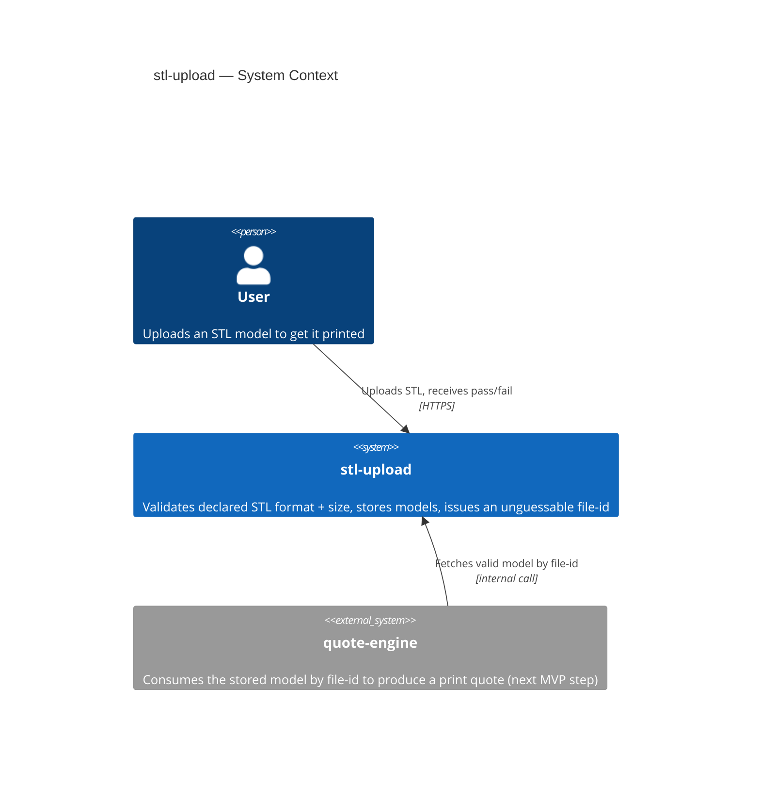
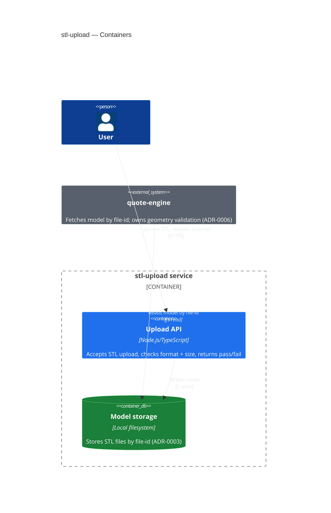
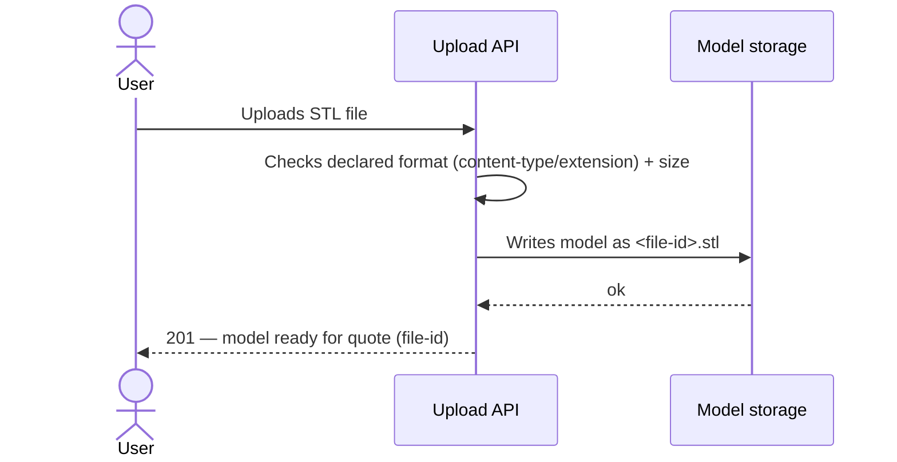
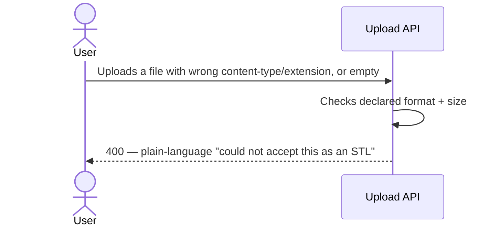
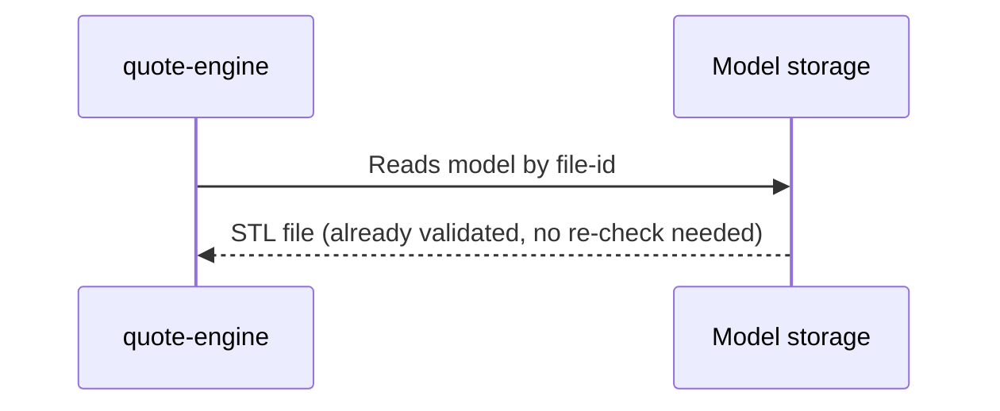

# Software Architecture Document — stl-upload

<!-- Stages 04-05 → see sdlc/plugin/skills/architecture-design/SKILL.md -->
<!-- 12 Arc42 sections. Empty sections — <!-- N/A: <one-line reason> -->. -->
<!-- C4 Context (L1) lives inline in §3. C4 Container (L2) lives inline in §5. -->

## 1. Introduction and goals

**Intent.** stl-upload — це точка входу всього MVP-флоу маркетплейсу 3D-друку (upload → quote → confirm/decline). Користувач без досвіду в 3D-моделюванні завантажує STL-файл; система синхронно перевіряє заявлений формат (content-type/розширення) і розмір, і або зберігає модель з унікальним ідентифікатором, готовим для quote-engine, або одразу пояснює зрозумілою мовою, чому файл відхилено (PRD §2 Goals, §1 Context). Перевірка геометрії (watertightness) винесена з цього модуля в quote-engine, що вже завантажує mesh у слайсер (ADR-0006).

**Top-3 quality goals (1-liners; full scenarios in §10):**

1. Надійність перевірки формату/розміру — проста, детермінована перевірка content-type/розширення + байтового розміру, без хибних відхилень валідних STL-файлів.
2. Безпечна обробка довільних завантажених байтів — без парсингу вмісту немає untrusted-parsing boundary (ADR-0006), але лишаються rate limiting і file-size cap як периметр захисту.
3. Продуктивність синхронної перевірки — p95 ≤10000 ms (PRD §6 Latency), щоб "негайна відповідь" залишалась негайною; без sandbox-форку цей бюджет досягається з великим запасом.

**Stakeholders.**

| Role | Interest | Sign-off owner? |
|---|---|---|
| User (uploader) | Отримує негайний yes/no без async-стану; довіряє, що модель приватна (US-01…US-05) | No |
| Tech Lead | Затверджує SAD перед stage 06 | Yes |
| Security Lead | Підтверджує обсяг security review — untrusted-parsing boundary більше не існує (ADR-0006); лишається rate limiting + зберігання довільних байтів (PRD §6.1) | Yes |

## 2. Constraints

**Technical.**
- Node.js + TypeScript — the only stack decision locked so far (`docs/overview.md`).
- No framework, datastore, or hosting choice made yet — open strategic decisions, resolved in §4/§5, not pre-existing constraints.

**Organisational.**
- Deadline: 2 тижні (hard, idea-brief §13 two-week solo-delivery constraint for Approach A).
- Team: solo maintainer, no on-call (PRD §6 Availability rationale).

**Conventions.**
- `CLAUDE.md` currently has no code conventions (repo is pre-code) — no pre-existing naming/error-handling pattern to inherit.

**Regulatory / external.**
- None new — PRD §6.1 classifies uploaded files as internal data, no new PII collected.
- Security review scope is TBD, pending Security Lead confirmation (PRD §6.1) — the untrusted-parsing boundary that originally required it is gone (ADR-0006); process gate, not a regulatory constraint.

## 3. Context and scope

<!-- brownfield: N/A — greenfield repo -->

Користувач без облікового запису завантажує STL-файл через веб. `stl-upload` синхронно перевіряє заявлений формат і розмір, зберігає модель з unguessable file-id (AC-04) і віддає цей file-id вниз по флоу для `quote-engine` — наступного кроку MVP-флоу (PRD §1, AC-05). Немає third-party інтеграцій і немає untrusted-parsing boundary (ADR-0006) — перевірка геометрії (watertightness) відбувається пізніше, всередині `quote-engine`, коли той завантажує mesh у слайсер.

**External systems (in / out):**

| Actor or system | Type | Interaction |
|---|---|---|
| User | Person | Завантажує STL, отримує негайний pass/fail (US-01…US-04) |
| quote-engine | System (internal, окрема фіча MVP) | Запитує валідну модель за file-id, без повторної валідації (AC-05) |

**C4 Context (L1):**



## 4. Solution strategy

**Inherited from idea-brief §13 (Approach A, locked — not re-litigated here):** synchronous, single-pass, local validate-then-store pipeline; no auto-repair; no queue/async processing.

**Descope note (ADR-0006):** геометрична валідація (watertightness) і пов'язаний sandboxed-парсинг (колишні стратегічні вибори ADR-0001, ADR-0002) винесені з stl-upload у quote-engine, який і так завантажує mesh у PrusaSlicer CLI для слайсингу — дублювати цю перевірку окремою npm-бібліотекою всередині stl-upload не було сенсу для MVP/PoC-обсягу, і це прибирає untrusted-parsing boundary, що вимагав sandbox. ADR-0001 і ADR-0002 позначені Superseded.

**Strategic choice (the seed for the remaining ADR):**

1. **Локальна файлова система для зберігання моделей (v1)** — STL-файли, що пройшли перевірку формату/розміру, зберігаються на диску сервера за `<file-id>.stl`; горизонтальне масштабування відкладене (accepted debt у §11). Узгоджено з §2 двотижневим дедлайном і §7 single-instance топологією v1. → ADR-0003.

Each tactical decision in later sections should be traceable to this strategic seed (or to ADR-0006's descope decision).

## 5. Building block view

Простий шаровий стиль (routes/services/repositories) — перша фіча в грінфілд-репозиторії, вибрано замість гексагонального через 2-тижневий solo-дедлайн (§2): менше файлів/інтерфейсів на старті. → ADR-0004. Фізична межа — один Node/TS-сервіс; окремого sandbox-процесу більше немає (ADR-0006) — `services/` виконує перевірку формату/розміру напряму, без форку child process.

**Internal decomposition:**

```
src/modules/stl-upload/
├── routes/       <HTTP handler: POST /uploads, DTO + response mapping>
├── services/      <upload-and-validate use case: content-type/extension + size check,
│                   then hands validated bytes to the repository>
├── repositories/  <read/write validated STL to local filesystem (ADR-0003)>
└── module.ts      <self-wiring>
```

**C4 Container (L2):**



## 6. Runtime view

**Critical flow 1: Happy path — valid STL upload (US-01, AC-01)**



**Critical flow 2: Invalid format (US-02, AC-02)**



<!-- Colишній "Critical flow 3: Non-watertight geometry" видалено (ADR-0006) — watertightness більше не перевіряється в stl-upload; еквівалентний потік тепер належить quote-engine. -->

**Critical flow 3: quote-engine fetches a model (US-05, AC-05)**



## 7. Deployment view

stl-upload запускається як один довгоживучий Node/TS-процес (systemd/pm2) на одній VM з локальним диском — узгоджено з ADR-0003 (файли на диску, недоступні між інстансами) і §2 двотижневим дедлайном (без оркестрації контейнерів). Не окрема ADR-гідна тема — це прямий наслідок уже прийнятого ADR-0003, не окреме рішення з альтернативами.

**Monitoring:**
- Метрика latency: тривалість upload-validate запиту (PRD §6 latency p95 ≤10000 ms).
- Alert: сплеск 5xx на upload endpoint — сигнал деградації чи атаки (rate limiting нижче — перша лінія захисту).
- Tracing: базовий request-id у логах (structured logging — узгодиться в §8).

**Scaling thresholds:**
- NFR throughput ≥5 req/s на інстанс (PRD §6) — досяжно в межах одного інстансу для MVP-навантаження.
- Горизонтальне масштабування (кілька інстансів) вимагає спершу міграції з ADR-0003 (локальний диск → object storage) — задокументовано як accepted debt у §11.

**Cross-module coupling (з ADR-0003):** quote-engine має бути спів-розташований на тому ж хості/диску, що й stl-upload, доки діє ADR-0003 (локальна файлова система) — quote-engine читає валідну модель напряму з диска (§5 C4 Container `Rel(quote_engine, fs, ...)`), без API-виклику до stl-upload.

<!-- N/A not applicable: this is the feature's first deployment unit, not a reuse of an existing one -->


## 8. Crosscutting concepts

<!-- Greenfield: CLAUDE.md has no pre-existing conventions to inherit — these are fresh decisions, not overrides. -->

| Concept | Convention | Where defined |
|---|---|---|
| Logging | Structured JSON logs, fields include `request_id`; no PII/file-content logged | here |
| Authentication | N/A — MVP has no accounts (PRD §3 Non-goals) | PRD §3 |
| Error handling | HTTP 400 (invalid format/oversized, AC-02), plain-language message, no mesh-repair jargon (PRD §2) | here |
| ID strategy | UUID v4 for file-id — unguessable, sole access control (ADR-0005) | ADR-0005 |
| Internationalisation | N/A, English only | — |
| Observability | Latency metrics (§7 Monitoring) | §7 |
| Rate limiting | 30 uploads/min per IP (PRD §6.1 abuse case #4) | PRD §6.1 |

## 9. Architecture decisions

<!-- Auto-populated as ADRs spawn in §4-§8 (Step 6 draft-generation.md) -->

| # | Title | Status | Section |
|---|---|---|---|
| 0001 | Use an existing npm library for STL geometry validation | Superseded by 0006 | §4 |
| 0002 | Sandbox untrusted STL parsing in a child process with resource limits | Superseded by 0006 | §4 |
| 0003 | Store validated models on local server filesystem for v1 | Accepted | §4 |
| 0004 | Use simple layered architecture (routes/services/repositories) for the first module | Accepted | §5 |
| 0005 | Use UUID v4 as the unguessable file-id | Accepted | §8 |
| 0006 | Descope mesh/geometry validation to quote-engine | Accepted | §4 |

ADR files live under `docs/features/stl-upload/adr/NNNN-<title>.md`.

## 10. Quality requirements

**QG-1. Безпечна обробка довільних завантажених байтів (Security)**
- **When:** користувач завантажує STL-файл через `POST /api/v1/uploads`.
- **Then:** немає untrusted-parsing boundary для експлуатації (ADR-0006 — перевіряється лише content-type/розширення + байтовий розмір, вміст файлу не парситься); залишковий захист — file-size cap (PRD §6) і rate limit (PRD §6.1 abuse case #4), а не sandbox.
- **How verify:** security review scope, звужений після ADR-0006 (PRD §6.1) — фінальне рішення про обсяг перевірки за Security Lead.

**QG-2. Продуктивність синхронної перевірки (Speed)**
- **When:** користувач завантажує STL-файл до max file size (≤50 MB, PRD §6).
- **Then:** p95 latency upload-validate запиту ≤10000 ms (PRD §6 Latency, дослівно); throughput ≥5 req/s per instance (PRD §6, дослівно). Без sandbox-форку (ADR-0006) цей бюджет має значний запас — конкретні виміряні числа не змінені тут, лише очікування легшого досягнення.
- **How verify:** k6 smoke test in CI (PRD §6 measurement column).

## 11. Risks and technical debt

<!-- N/A: greenfield — no brownfield gotchas from Explore report -->

| Risk / debt | Severity | Mitigation | Owner |
|---|---|---|---|
| Горизонтальне масштабування заблоковане локальним диском (ADR-0003 Negative) — кілька інстансів не бачать одні й ті ж файли | Medium | Мігрувати на S3-сумісне сховище, якщо throughput перевищить одноінстансний ліміт (§7 Scaling thresholds) | Yakiv Vakoliuk |
| Feasibility фічі (greenfield, без track record) непідтверджена — idea-brief §12 | Low | Переглянути після першого реального шипу фічі (PRD §8, owner: Yakiv Vakoliuk, due: after stl-upload ships) | Yakiv Vakoliuk |

**Accepted debt (acceptable in v1, plan to fix later):**
- Простий шаровий стиль (ADR-0004) може вимагати рефакторингу у гексагональний, якщо `services/` виросте без чіткої межі між форматною перевіркою і бізнес-правилами — прийнятно для першого модуля за 2-тижневий дедлайн.
- UUID v4 (ADR-0005) не сортується за часом створення — якщо знадобиться листинг за recency, треба окрема колонка `created_at`, не сам id.

## 12. Glossary

| Term | Meaning |
|---|---|
| STL file | Формат файлу, що кодує поверхню моделі як набір трикутників. NOT model (модель — абстрактний 3D-об'єкт; файл — конкретне кодування) — CONTEXT.md. |
| Watertight mesh | Поверхня 3D-моделі без дірок (замкнута/manifold геометрія), потрібна слайсеру. Перевіряється в `quote-engine`, НЕ в `stl-upload` (ADR-0006) — NOT valid file format — CONTEXT.md. |
| Model | 3D-об'єкт, який користувач хоче надрукувати. NOT STL file — CONTEXT.md. |
| Valid model (у контексті stl-upload) | STL-файл з коректним заявленим форматом і розміром у межах ліміту. Watertightness тут НЕ перевіряється й НЕ гарантується (ADR-0006) — NOT a geometry-validated model — CONTEXT.md. |
| User | Особа, яка завантажує модель для друку. NOT vendor (vendor-facing tooling — поза MVP) — CONTEXT.md. |
| File-id | Системно згенерований UUID v4, єдиний механізм доступу до моделі в v1 (ADR-0005). Не в CONTEXT.md — флаг для `sdlc:fix-term` follow-up. |

<!-- "File-id" surfaced during this pass and isn't yet in CONTEXT.md — flag for sdlc:fix-term follow-up. -->

