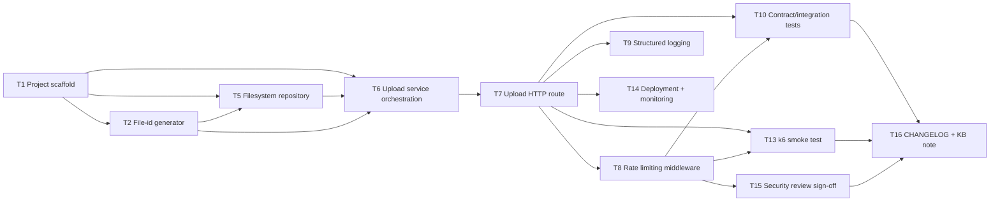

# Task breakdown — stl-upload

<!-- Stage 13 → see sdlc/plugin/skills/break-tasks/SKILL.md -->

## Upstream artefacts

- [PRD](../PRD.md) — AC-01, AC-02, AC-04, AC-05, §6 NFR, §6.1 Security/privacy
- [SAD](../sad.md) — §5 Building block view, §6 Runtime view, §7 Deployment, §8 Crosscutting, §9 ADR index, §10 Quality requirements
- ADRs: [0001](../adr/0001-npm-mesh-validation-library.md) mesh-validation library (Superseded) · [0002](../adr/0002-child-process-sandbox.md) child_process sandbox (Superseded) · [0003](../adr/0003-local-filesystem-storage.md) local filesystem storage (Accepted) · [0004](../adr/0004-layered-architecture.md) layered architecture (Accepted) · [0005](../adr/0005-uuid-v4-file-id.md) UUID v4 file-id (Accepted) · [0006](../adr/0006-descope-mesh-validation-to-quote-engine.md) descope mesh validation to quote-engine (Accepted)
- [data-model.md](../data-model.md) — no relational entities; filesystem-only persistence
- [openapi.yaml](../contracts/openapi.yaml) — single endpoint `POST /api/v1/uploads`

## Scope note

This is a single-endpoint feature (`POST /api/v1/uploads`, per [openapi.yaml](../contracts/openapi.yaml)) with no database — the breakdown below decomposes by SAD §5 layer (routes/services/repositories) and NFR/security verification work (PRD §6, §6.1), rather than by CRUD surface. Per ADR-0006, mesh/geometry validation and its sandboxing are out of scope for stl-upload entirely (moved to quote-engine) — there is no sandbox boundary in this breakdown anymore.

Out of scope for this breakdown (not yet in PRD/SAD, flagged by [data-model.md](../data-model.md) "Not addressed by this pass"): connection-close cleanup of in-progress uploads. Do not create an implementation task for it until it lands in PRD/SAD.

## Dependency graph

## Tasks

| ID | Title | DoR | DoD | Deps | Estimate | Owner |
|----|-------|-----|-----|------|----------|-------|
| T1 | Project scaffold + module skeleton (SAD §5) | SAD §5 Approved | `tsc --noEmit` + lint pass; empty `src/modules/stl-upload/{routes,services,repositories}` wired via `module.ts` into a starting app | — | S | Yakiv Vakoliuk |
| T2 | File-id generator (ADR-0005) | T1 merged | Unit tests: `crypto.randomUUID()` wrapper returns v4-format string, uniqueness over N calls | T1 | XS | Yakiv Vakoliuk |
| T5 | Filesystem repository (ADR-0003) | T1, T2 merged | `repositories/` write fn stores `<file-id>.stl` under a configurable directory; unit test asserts file exists at expected path after write | T1, T2 | S | Yakiv Vakoliuk |
| T6 | Upload service orchestration (SAD §5 `services/`) | T1, T5, T2 merged | Service checks declared content-type/extension + size, then composes repository write → file-id; returns typed result (valid / invalid-format); unit tests for both outcomes | T1, T5, T2 | S | Yakiv Vakoliuk |
| T7 | Upload HTTP route (SAD §5 `routes/`) | T6 merged | `POST /api/v1/uploads` — multipart parsing, 50 MB enforcement (413), maps service result to 201/400 per [openapi.yaml](../contracts/openapi.yaml) schemas/examples | T6 | M | Yakiv Vakoliuk |
| T8 | Rate limiting middleware (PRD §6.1 abuse case #4) | T7 merged | 30 uploads/min/IP enforced; 31st request in a window returns 429 with `upload.rate_limited` body per openapi.yaml | T7 | S | Yakiv Vakoliuk |
| T9 | Structured logging + request_id (SAD §8) | T7 merged | Every request logs `request_id` as structured JSON; no file content or PII logged | T7 | XS | Yakiv Vakoliuk |
| T10 | Contract/integration tests — AC-01, AC-02, AC-04, AC-05 | T7, T8 merged | Integration suite covers 201/400/413/429 against openapi.yaml examples; each of AC-01, AC-02, AC-04, AC-05 traceable to ≥1 passing test | T7, T8 | S | Yakiv Vakoliuk |
| T13 | k6 smoke test (PRD §6 Latency/Throughput) | T7, T8 merged | k6 script in CI asserts p95 ≤10000 ms and ≥5 req/s per instance | T7, T8 | S | Yakiv Vakoliuk |
| T14 | Deployment config + monitoring (SAD §7) | T7 merged | systemd/pm2 unit runs the service on the target VM; latency metric wired | T7 | S | Yakiv Vakoliuk |
| T15 | Security review sign-off (PRD §6.1 — scope narrowed by ADR-0006) | T8 merged | Security Lead reviews the remaining surface: rate limiting + storage of arbitrary uploaded bytes under an unguessable file-id; confirms whether a full review or a lighter checklist is warranted now that no untrusted-parsing boundary exists; sign-off recorded per SAD §1 stakeholders table | T8 | S | Security Lead |
| T16 | CHANGELOG + KB note | T10, T13, T15 done | CHANGELOG entry + short KB note on the upload contract for quote-engine (AC-05 handoff), noting mesh/geometry validation is quote-engine's responsibility (ADR-0006); tag created | T10, T13, T15 | XS | Yakiv Vakoliuk |

## Estimation legend

- XS: ≤2h
- S: ≤1d
- M: 1-2d (borderline — consider splitting)
- L: must be split, ≤1d did not work out
